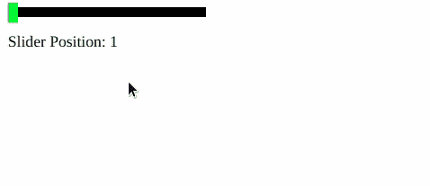

# 脚本 aculo.us 创建滑块

> 原文: [https://www.geeksforgeeks.org/script-aculo-us-create-sliders/](https://www.geeksforgeeks.org/script-aculo-us-create-sliders/)

滑块是一种小轨道，您可以沿着它滑动手柄。它转化为一个数值。使用 script.aculo.us 的滑块模块，您可以创建具有大量控制的滑块。

**语法:**

```javascript
new Control.Slider(handle, track, {options});
```

**滑块选项:**

| **选项** | **说明** |
| --- | --- |
| 轴 | 可以用来设置滑块的轴，即水平或垂直。默认是水平。 |
| 范围 | 可以用来设置滑块的取值范围。 |
| 滑块值 | 可以用来设置滑块的初始位置。默认位置是范围的初始值。 |
| 值 | 可以用来设置滑块在其范围内可以取的离散值。 |
| 禁用 | 可以用来创建初始时禁用的滑块。 |
| 设置值 | 可以用来设置滑块的值和位置。 |
| 设置禁用 | 可以用来禁用滑块。 |
| 设置启用 | 可以用来启用滑块。 |

**回调选项:**

| **选项** | **描述** |
| --- | --- |
| on slide | 当滑块被拖动时触发。此函数将滑块值作为其参数。 |
| onChange | 当滑块值改变时触发。此函数将滑块值作为其参数。 |

**示例:**

```html
<!DOCTYPE html> 
<html>

<head> 
    <script type="text/javascript"
        src="prototype.js"> 
    </script>

<script type="text/javascript"
        src="scriptaculous.js?load=slider"> 
    </script>

<script> 
        window.onload = function () { 
            new Control.Slider('handle', 'track', { 
                range: $R(1, 100), 
                values: [1, 10, 20, 30, 40, 50, 60, 70, 80, 90, 100], 
                sliderValue: 1, 
                onSlide: function (value) { 
                    $('sliderValue').innerHTML 
                        = 'Slider Position: ' + value; 
                } 
            }); 
        } 
    </script>

<style> 
    .track { 
        background-color: rgb(0, 0, 0); 
        position: relative; 
        height: 10px; 
        width: 200px; 
        cursor: pointer; 
    }

    .handle { 
        background-color: #13e421; 
        height: 20px; 
        width: 4.25px; 
        top: -4.25px; 
        cursor: move; 
    } 
</style> 
</head>

<body> 
    <div id="track" class="track "> 
        <div id="handle" class="handle"
            style="width: 10px;"> 
        </div> 
    </div>

<p id="sliderValue"></p>

</body>

</html>
```

**输出:**


