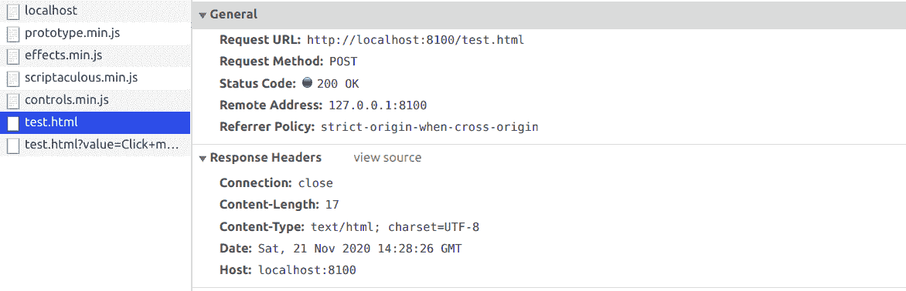
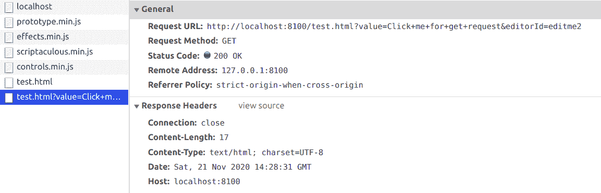

# script.aculo.us 中 InPlaceEditor 的 ajaxOptions 选项

> 原文: [https://www.geeksforgeeks.org/script-aculo-us-inplaceeditor-ajaxoptions-option/](https://www.geeksforgeeks.org/script-aculo-us-inplaceeditor-ajaxoptions-option/)

`script.aculo.us` 库是一个跨浏览器库，旨在改善网站的用户界面。`Ajax.InPlaceEditor` 用于使元素可编辑，从而允许用户编辑页面上的内容并将更改提交给服务器。

在定义指定给所有 AJAX 调用的选项时，使用了 InPlaceEditor 中的 `ajaxOptions` 选项。简而言之，我们可以在编辑了 InPlaceEditor 之后，控制在提交文本期间发出的请求的类型。

**语法:**

```
{ ajaxOptions: object}
```

**值:**

*   `object`: 这是一个包含 ajax 选项的对象。

**示例:**

要演示此功能的使用，请参考以下代码。代码的 JavaScript 部分将为特定元素创建一个 InPlaceEditor。创建一个名为 `test.html` 的文件，我们将使用它来发出请求。这个 `test.html` 将包含一个简单的文本 `GeeksforGeeks`。点击“Click me”，你会看到 InPlaceEditor。只需点击“OK”来提出请求，然后我们将从 Chrome 的开发工具中的网络选项卡检查请求的类型。当你点击“OK”时，它会创建一个请求，并在网络选项卡中弹出一个“test.html”，如下截图所示。

**注意:**
使用服务器运行具有 ajax 功能的文件。在本文中，我们使用的是一个 PHP 服务器。

### HTML

```
<!DOCTYPE html>
<html>

<head>
    <!-- Include the required scripts -->
    <script type="text/javascript"
        src="prototype.js"> 
    </script>

<script type="text/javascript"
        src="scriptaculous.js?load=effects,controls"> 
    </script> 
</head>

<body>
    <p id="editme1">Click me for post request</p>
    <p id="editme2">Click me for get request</p>

<!-- Script for the JavaScript part to 
         initialize the objects -->
    <script type="text/javascript">
        new Ajax.InPlaceEditor('editme1', 'test.html',
         { ajaxOptions: { method: 'post' } });
        new Ajax.InPlaceEditor('editme2', 'test.html', 
        { ajaxOptions: { method: 'get' } });
    </script>
</body>

</html>
```

**POST 请求输出:**



**GET 请求的输出:**



可以看到，第一个请求方法是 POST，第二个是 GET。

`test.html` 文件的内容如下，这是上述 HTML 代码中使用的文件。

```
<!DOCTYPE html> 
<html>

<body> 
    GeeksforGeeks
</body>

</html> 
```