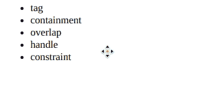
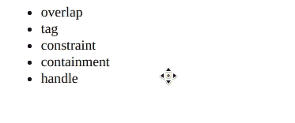

# 脚本 aculo.us 排序约束选项

> 原文：[https://www.geeksforgeeks.org/script-aculo-us-sorting-constraint-option/](https://www.geeksforgeeks.org/script-aculo-us-sorting-constraint-option/)

可排序模块中的约束选项用于在拖动元素时限制元素的移动方向。它可以设置为`'horizontal'`或`'vertical'`，从而只允许在该方向上移动。它的默认值是`'vertical'`。

**语法：**

```
Sortable.create('list', {constraint: 'horizontal' | 'vertical' })
```

以下示例演示了该选项：

## 示例 1：水平约束

在本例中，约束选项设置为`'horizontal'`。

```html
<!DOCTYPE html>
<html>

<head>
    <script type="text/javascript" 
        src="prototype.js">
    </script>

<script type="text/javascript" 
        src="scriptaculous.js">
    </script>

<style>
        li {
            cursor: move;
        }
    </style>
</head>

<body>
    <ul id="list">
        <li>tag</li>
        <li>overlap</li>
        <li>constraint</li>
        <li>containment</li>
        <li>handle</li>
    </ul>

<script>
        Sortable.create('list', {
            tag: 'li',
            constraint: 'horizontal'
        });
    </script>
</body>

</html>
```

**输出：**



## 示例 2：垂直约束

在此示例中，约束选项设置为`'vertical'`。

```html
<!DOCTYPE html>
<html>

<head>
    <script type="text/javascript" 
        src="prototype.js">
    </script>

<script type="text/javascript" 
        src="scriptaculous.js">
    </script>

<style>
        li {
            cursor: move;
        }
    </style>
</head>

<body>
    <ul id="list">
        <li>tag</li>
        <li>overlap</li>
        <li>constraint</li>
        <li>containment</li>
        <li>handle</li>
    </ul>

<script>
        Sortable.create('list', {
            tag: 'li',
            constraint: 'vertical'
        });
    </script>
</body>

</html>
```

**输出：**

