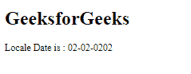
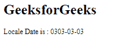

# Angular 10 formatDate() 方法

> 原文: [https://www.geeksforgeeks.org/angular-10-formatdate-method/](https://www.geeksforgeeks.org/angular-10-formatdate-method/)

在本文中，我们将看到什么是 Angular 10 中的 `formatDate` 以及如何使用它。`formatDate` 用于根据地区规则格式化日期。

## 语法

```ts
formatDate(value, locale, format, timezone)
```

## 参数

*   `value`: 要格式化的数字。
*   `locale`: 地区格式的地区代码。
*   `format`: 要包含的日期时间成分。
*   `timezone`: 该地的时区。

## 返回值

*   `string`: 格式化的日期字符串。

## 模块

`formatDate` 使用的模块为:

*   `CommonModule`

## 实现步骤

1.  创建要使用的 Angular 应用程序。
2.  在 `app.module.ts` 中导入 `LOCALE_ID`，因为我们需要使用 `formatDate` 并导入 `LOCALE`。
3.  在 `app.component.ts` 中导入 `formatDate` 和 `LOCALE_ID`。
4.  将 `LOCALE_ID` 作为公共变量注入。
5.  在 `app.component.html` 中，使用字符串插值显示局部变量。
6.  使用 `ng serve` 为 Angular 应用提供服务，以查看输出。

## 示例 1

### app.component.ts

```ts
import { formatDate } from '@angular/common';
import { Component, Inject, LOCALE_ID } from '@angular/core';

@Component({
  selector: 'app-root',
  templateUrl: './app.component.html'
})
export class AppComponent {
  curr = formatDate("02-feburary-0202", 'dd-MM-yyyy', this.locale);
  constructor(@Inject(LOCALE_ID) public locale: string) {}
}
```

### app.component.html

```html
<h1>
  GeeksforGeeks
</h1>

<p>Locale Date is : {{curr}}</p>
```

### 输出



## 示例 2

### app.component.ts

```ts
import { formatDate } from '@angular/common';
import { Component, Inject, LOCALE_ID } from '@angular/core';

@Component({
  selector: 'app-root',
  templateUrl: './app.component.html'
})
export class AppComponent {
  curr = formatDate("03-march-0303", 'yyyy-dd-MM', this.locale);
  constructor(@Inject(LOCALE_ID) public locale: string) {}
}
```

### app.component.html

```html
<h1>
  GeeksforGeeks
</h1>

<p>Locale Date is : {{curr}}</p>
```

### 输出



## 参考

[https://angular.io/api/common/formatDate](https://angular.io/api/common/formatDate)