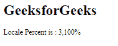

# Angular 10 `formatPercent()` 方法

> 原文: [https://www.geeksforgeeks.org/angular-10-formatpercent-method/](https://www.geeksforgeeks.org/angular-10-formatpercent-method/)

在本文中，我们将了解什么是 Angular 10 中的 `formatPercent`，以及如何使用它。`formatPercent` 用于根据区域设置规则将数字格式化为百分比。

## 语法

```ts
formatPercent(value, locale, digitsInfo)
```

## 参数

*   `value`: 要格式化的数字。
*   `locale`: 地区格式的地区代码。
*   `digitsInfo`: 十进制表示选项。

## 返回值

*   `string`: 格式化的百分比字符串。

## 模块

`formatPercent` 使用的模块为:

*   `CommonModule`

## 实现步骤

*   创建要使用的 Angular 应用程序。
*   在 `app.module.ts` 中导入 `LOCALE_ID`，因为我们需要使用 `formatPercent` 并导入区域设置。

```ts
import { LOCALE_ID, NgModule } from '@angular/core';
```

*   在 `app.component.ts` 导入 `formatPercent` 和 `LOCALE_ID`。
*   将 `LOCALE_ID` 作为公共变量注入。
*   在 `app.component.html`，使用字符串插值显示局部变量。
*   使用 `ng serve` 为 Angular 应用服务，以查看输出。

## 示例 1

### app.component.ts

```ts
import {
  formatPercent
}
  from '@angular/common';

import {Component,
  Inject,
  LOCALE_ID }
  from '@angular/core';

@Component({
selector: 'app-root',
templateUrl: './app.component.html'
})
export class AppComponent {
curr = formatPercent(31,this.locale,
          '3.0-4');
constructor(
  @Inject(LOCALE_ID) public locale: string,){}
}
```

### app.component.html

```ts
<h1>
  GeeksforGeeks
</h1>

<p>Locale Percent is : {{curr}}</p>
```

## 输出



## 示例 2

### app.component.ts

```ts
import {
  formatPercent
}
  from '@angular/common';

import {Component,
  Inject,
  LOCALE_ID }
  from '@angular/core';

@Component({
selector: 'app-root',
templateUrl: './app.component.html'
})
export class AppComponent {
curr = formatPercent(31,this.locale,
          '3.2-4');
constructor(
  @Inject(LOCALE_ID) public locale: string,){}
}
```