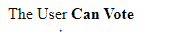
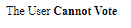

# Angular 10 I18nSelectPipe API

> 原文: [https://www.geeksforgeeks.org/angular-10-i18nselectpipe-api/](https://www.geeksforgeeks.org/angular-10-i18nselectpipe-api/)

在本文中，我们将看到什么是 Angular 10 中的 `I18nSelectPipe` 以及如何使用它。

`I18nSelectPipe` 是一个选择器，用于显示与当前值匹配的字符串。

**语法:**

```ts
{{ value | i18nSelect : map }}
```

**模块:** `I18nSelectPipe` 使用的模块是 `CommonModule`。

**步骤:**

*   创建一个要使用的 Angular 应用程序。
*   不需要任何导入就可以使用 `I18nSelectPipe`。
*   在 `app.component.ts` 中，定义采用 `I18nSelectPipe` 值的变量。
*   在 `app.component.html`，使用上面带有“`|`”符号的语法来创建 `I18nSelectPipe` 元素。
*   使用 `ng serve` 为 Angular 应用服务，以查看输出。

**输入值:**

*   `value`: 取一个字符串值。
*   `map`: 取一个对象值，表示不同值应该显示的文本。

**例 1:**

## app.component.ts

```ts
import { Component, OnInit } from '@angular/core';

@Component({
    selector: 'app-root',
    templateUrl: './app.component.html'
})
export class AppComponent {
    // Age Variable
    age : string = 'twenty';

    // Map from which I18nSelectPipe takes the value
    votin : any = {'twenty': 'Can Vote', 'seventeen':'Cannot Vote'};
}
```

## app.component.html

```ts
<!-- In Below Code I18nSelectPipe is used -->
<div>The User <b>{{age | i18nSelect: votin}}</b> </div>
```

**输出:**



**例 2:**

## app.component.ts

```ts
import { Component, OnInit } from '@angular/core';

@Component({
    selector: 'app-root',
    templateUrl: './app.component.html'
})
export class AppComponent {
    // Age Variable
    age : string = 'seventeen';

    // Map from which I18nSelectPipe takes the value
    votin : any = {'twenty': 'Can Vote', 'seventeen':'Cannot Vote'};
}
```

## app.component.html

```ts
<!-- In Below Code I18nSelectPipe is used -->
<div>The User <b>{{age | i18nSelect: votin}}</b> </div>
```

**输出:**



**参考:** [https://angular.io/api/common/I18nSelectPipe](https://angular.io/api/common/I18nSelectPipe)