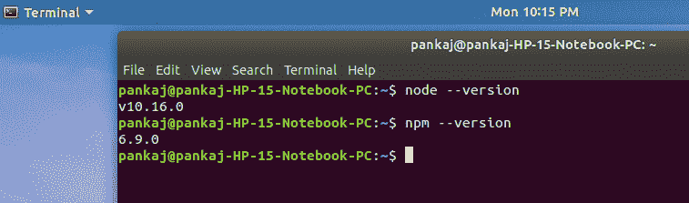
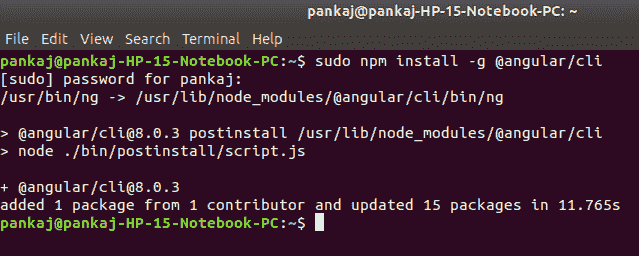
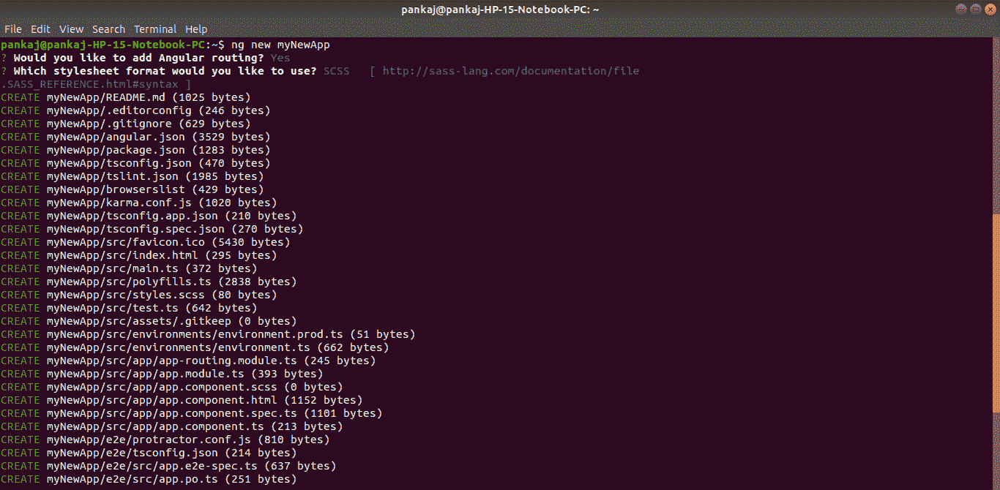
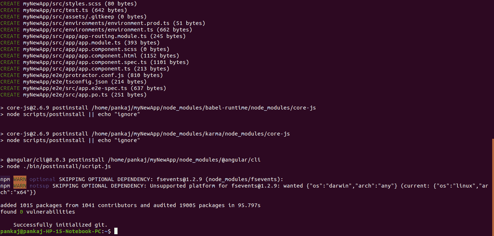
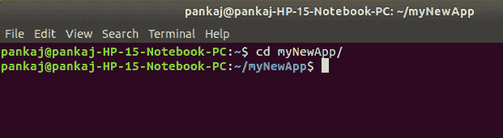
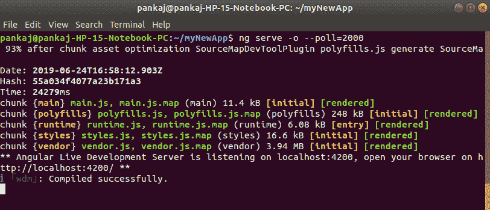
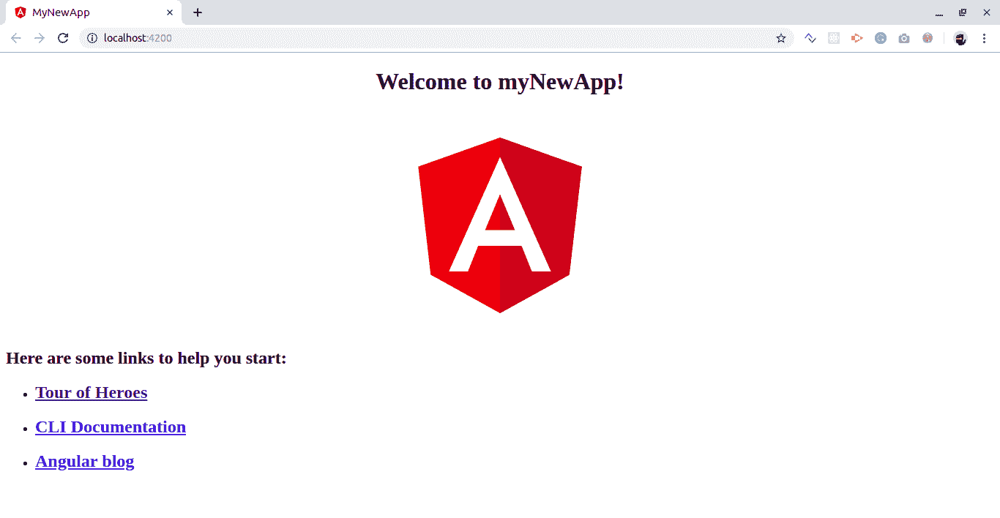
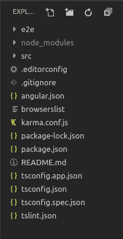
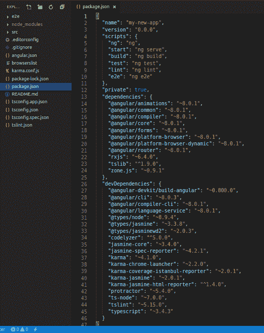

# Angular CLI | Angular 项目设置

> 原文: [https://www.geeksforgeeks.org/angular-cli-angular-project-setup/](https://www.geeksforgeeks.org/angular-cli-angular-project-setup/)

**Angular** 是一个用于创建 web 应用的前端框架。默认情况下，它使用 TypeScript 为类创建逻辑和方法，但是浏览器不知道 TypeScript。这里 webpack 进来的图片，webpack 是用来把这些 TypeScript 文件编译成 JavaScript 的。此外，在您的计算机上运行一个 Angular 项目需要如此多的配置文件。
**Angular CLI** 是一个工具，可以通过一些简单的命令为你完成所有这些事情。Angular CLI 使用后面的 webpack 来完成所有这些过程。

**注意:** 请确保您的系统中已经安装了 Node 和 npm。您可以使用以下命令检查您的 Node 版本和 npm 版本:

```
node --version
npm --version
```



## 使用 Angular CLI 创建第一个应用程序的步骤:

### Step-1: Install Angular CLI

```
npm install -g @angular/cli
```



### Step-2: Create a new project

通过此命令创建新项目，选择是否作为路由选项，选择 CSS 或 SCSS。

```
ng new myNewApp
```




### Step-3: Go to your project directory

```
cd myNewApp
```



### Step-4: Run server and see your application in action

```
ng serve -o --poll=2000
```




## 目录结构介绍:



*   `e2e` 包含与自动化测试目的相关的代码。例如，如果在某个页面上你正在调用一个 REST API，那么返回状态代码应该是什么，它是否可接受等等。
*   `node_modules` 它保存所有的开发依赖项（仅在开发时使用）和依赖项（用于开发以及在生产时需要），任何新的依赖项在添加到项目时都会自动保存到该文件夹中。
*   `src` 这个目录包含了我们所有与项目相关的工作，即创建组件、创建服务、将 CSS 添加到各自的页面等。
*   `package.json` 该文件存储安装了指定版本的项目中添加和使用的库的信息。每当一个新的库被添加到项目中，它的名称和版本就会被添加到 `package.json` 中的依赖项中。
    

**其他文件:** 作为初学者，此时不需要这些文件，不必为此费心。这些都用于编辑器配置和编译时所需的信息。Angular CLI 中内置的 webpack 为您管理所有内容。

## src 文件夹内:

*   `index.html` 这是应用程序的入口点，`app-root` 标签是应用程序在这个单页应用程序上的入口点，在这个页面上 Angular 会在 DOM 中添加或删除内容或将新内容添加到 DOM 中。`<base href="/">` 对于布线很重要。

```html
<!DOCTYPE HTML>
<html lang="en">
    <head>
        <meta charset="utf-8">
        <title>MyNewApp</title>
        <base href="/">
        <meta name="viewport" content="width=device-width, initial-scale=1">
        <link rel="icon" type="image/x-icon" href="favicon.ico">
    </head>
    <body>
        <app-root></app-root>
    </body>
</html>
```

*   `style.scss` 这个文件是你可以添加到很多组件通用的 CSS 类或者选择器的全局样式表，比如你可以导入自定义字体，导入 `bootstrap.css` 等。
*   `assets` 它包含了 JS、图像、字体、图标和许多其他项目文件。

## app 文件夹内:

*   `app.module.ts` 一个 Angular 项目是由许多其他模块组成的，为了创建一个应用程序，您必须在层次结构中为您的应用程序创建一个根模块。这个 `app.module.ts` 文件就是那个。如果您想在根级别添加更多模块，您可以添加。
    *   `declarations` 它是数组存储其组件的引用。应用程序组件是创建项目时生成的默认组件。您必须将所有组件的引用添加到该数组中，以使它们在项目中可用。
    *   `imports` 如果你想添加任何模块，无论是 Angular 的还是你必须将其添加到导入数组中，以使它们在整个项目中可用。
    *   `providers` 如果您将为您的应用程序创建任何服务，那么您将通过这个提供者数组将其注入到您的项目中。注入到模块中的服务对它及其在项目层次结构中的子模块是可用的。
    *   `bootstrap` 这里引用了创建的默认组件，即 `AppComponent`。
*   `app.component.html` 编辑此文件以更改页面。您可以将此文件编辑为 HTML 文件。直接使用 `div` 或 `body` 标签中使用的任何其他标签，这些是组件，不添加 `html`、`head`、`body` 标签。

```html
<h1>
    Hello world
</h1>
<div>
    <p>
        This is my First Angular app.
    </p>
</div>
```

*   `app.component.spec.ts` 这些是自动生成的文件，包含源组件的单元测试。
*   `app.component.ts` 你可以在 `.ts` 文件中编写组件的逻辑。处理将包括连接到数据库、与其他组件交互、路由、服务等活动。
*   `app.component.scss` 这里可以给你的组件添加 CSS。你可以写 SCSS，然后由 transpiler 进一步编译成 CSS。

## 在进行项目时需要的更多命令:

```
ng generate component component_name
ng generate service service_name
ng generate directive directive_name
```