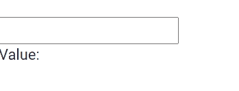

# 角色形式控制指令

> 原文：[https://www.geeksforgeeks.org/angular-forms-formcontroldirective/](https://www.geeksforgeeks.org/angular-forms-formcontroldirective/)

在本文中，我们将看到什么是 Angular 10 中的 `FormControlDirective`，以及如何使用它。

### 表单控制指令

`FormControlDirective` 用于将独立的 `FormControl` 实例与表单控件元素同步。

```ts
<form [FormControlDirective]="name">
```

### 出口自

*   `ReactiveFormsModule`

### 选择器

*   `[formControl]`

### 进场

*   创建要使用的 Angular 应用程序。
*   在 `app.component.ts` 中，创建一个包含输入值的对象。
*   在 `app.component.html`，使用 `FormControlDirective` 获取值。
*   使用 `ng serve` 为 Angular 应用服务，以查看输出。

### 示例

## app.component.ts

```ts
import { Component, Inject } from '@angular/core';
import { FormGroup, FormControl, FormArray } from '@angular/forms'
@Component({
  selector: 'app-root',
  templateUrl: './app.component.html',
  styleUrls: [ './app.component.css' ]
})
export class AppComponent {
  geek: FormControl = new FormControl('');
}
```

## app.component.html

```ts
<br>
<input [formControl]="geek">

<p>Value: {{ geek.value }}</p>
```

### 输出



### 参考

[https://angular.io/api/forms/FormControlDirective](https://angular.io/api/forms/FormControlDirective)