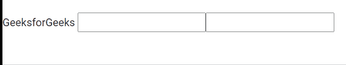

# Angular最大长度验证器指令

> 原文：[https://www.geeksforgeeks.org/angular-forms-maxlengthvalidator-directive/](https://www.geeksforgeeks.org/angular-forms-maxlengthvalidator-directive/)

在本文中，我们将看到什么是 Angular 10 中的 `MaxLengthValidator`，以及如何使用它。
`MaxLengthValidator` 用于将独立的表单控件实例与表单控件元素同步。

```ts
<input maxLength ="number">
```

## 导出于

*   `ReactiveFormsModule`
*   `FormsModule`

## 选择器

*   `[maxLength][formControlName]`
*   `[maxLength][formControl]`
*   `[maxLength][ngModel]`

## 步骤

1.  创建要使用的 Angular 应用程序。
2.  在 `app.component.html` 中，为 `input` 设置 `maxLength` 属性，这样当您在该输入元素中输入数据时，就不会超过最大值。
3.  使用 `ng serve` 为 Angular 应用提供服务，以查看输出。

## 示例

### app.component.html

```ts
<span>GeeksforGeeks</span>
<input type="text" maxlength="12">
<input maxlength="5">
```

### 输出



**参考：** [https://angular.io/api/forms/MaxLengthValidator](https://angular.io/api/forms/MaxLengthValidator)