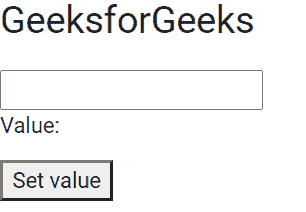

# 角形模型指令

> 原文: [https://www.geeksforgeeks.org/angular-forms-ngmodel-directive/](https://www.geeksforgeeks.org/angular-forms-ngmodel-directive/)

在这篇文章中，我们将看到什么是 Angular 10 中的 `NgModel`，以及如何使用它。`NgModel` 用于创建顶级表单组实例，它将表单绑定到给定的表单值。

### 语法:

```ts
<input [(ngModel)]="name">
```

### 模块:

使用的模块是 `FormsModule`。

### 选择器:

`[ngModel]`

### 进场:

*   创建要使用的角度应用程序。
*   在 `app.component.ts` 中，创建一个给输入字段赋值的变量。
*   在 `app.component.html`，制作一个表格并使用 `ngModel` 获取输入的值。
*   使用 `ng serve` 为 angular app 服务，以查看输出。

### 例 1:

## app.component.ts

```ts
import { Component, Inject } from '@angular/core';
import { PLATFORM_ID } from '@angular/core';
import { isPlatformWorkerApp } from '@angular/common';

@Component({
    selector: 'app-root',
    templateUrl: './app.component.html',
    styleUrls: [ './app.component.css' ]
})
export class AppComponent {
    gfg: string = '';

    setValue() {
        this.gfg = 'GeeksforGeeks';
    }
}
```

## app.component.html

```ts
<h1>GeeksforGeeks</h1>

<input [(ngModel)]="gfg" #ctrl="ngModel" required>

<p>Value: {{ gfg }}</p>

<button (click)="setValue()">Set value</button>
```

### 输出:



### 参考:

[https://angular.io/api/forms/NgModel](https://angular.io/api/forms/NgModel)