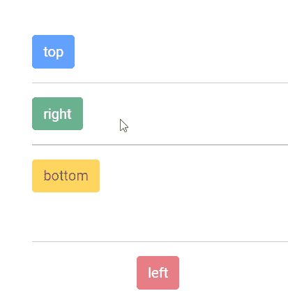

# Angular ng-bootstrap 工具提示（Tooltip）组件

> 原文：[https://www.geeksforgeeks.org/angular-ng-bootstrap-tooltip-component/](https://www.geeksforgeeks.org/angular-ng-bootstrap-tooltip-component/)

Angular ng-bootstrap 是一个 Bootstrap 框架，与 Angular 一起使用来创建具有优良样式的组件。该框架非常易于使用，适用于制作响应式网站。在本文中，我们将了解如何在 Angular ng-bootstrap 中使用 Tooltip。

`工具提示`用于当用户将鼠标悬停在某个元素上、聚焦在该元素上或点击该元素时显示信息性文本。

## 安装语法

```bash
ng add @ng-bootstrap/ng-bootstrap
```

## 方法

1.  首先，使用上述命令安装 Angular ng bootstrap。
2.  在 `index.html` 文件中添加以下样式表链接：
    ```html
    <link href="https://maxcdn.bootstrapcdn.com/bootstrap/4.0.0/css/bootstrap.min.css" rel="stylesheet">
    ```
3.  在你的 Angular 模块（例如 `app.module.ts`）中导入 `NgbModule`：
    ```typescript
    import { NgbModule } from '@ng-bootstrap/ng-bootstrap';

    @NgModule({
      imports: [
        // ... 其他模块
        NgbModule
      ]
    })
    export class AppModule { }
    ```
4.  在 `app.component.html` 文件中创建工具提示组件。
5.  使用 `ng serve` 为应用提供服务。

## 示例 1

在这个示例中，我们制作一个工具提示的基本示例。

### app.component.html

```html
<div id='geeks'>
    <br /><br /><br />
    <button type="button"
        class="btn btn-primary"
        placement="top"
        ngbTooltip="GeeksforGeeks">
        top
    </button>
    <hr>
    <button type="button"
        class="btn btn-success"
        placement="right"
        ngbTooltip="GeeksforGeeks">
        right
    </button>
    <hr>
    <button type="button"
        class="btn btn-warning"
        placement="bottom"
        ngbTooltip="GeeksforGeeks">
        bottom
    </button>
    <br /><br /><br />
    <hr>
    <button id='gfg' type="button"
        class="btn btn-danger"
        placement="left"
        ngbTooltip="GeeksforGeeks">
        left
    </button>
</div>
```

### app.module.ts

```typescript
import { NgModule } from '@angular/core';
import { FormsModule, ReactiveFormsModule } from '@angular/forms';
import { BrowserModule } from '@angular/platform-browser';
import { BrowserAnimationsModule } from '@angular/platform-browser/animations';
import { AppComponent } from './app.component';
import { NgbModule } from '@ng-bootstrap/ng-bootstrap';

@NgModule({
    bootstrap: [
        AppComponent
    ],
    declarations: [
        AppComponent
    ],
    imports: [
        FormsModule,
        BrowserModule,
        BrowserAnimationsModule,
        ReactiveFormsModule,
        NgbModule
    ]
})
export class AppModule { }
```

### app.component.css

```css
#gfg {
    margin-left:120px
}
#geeks {
    margin-left:40px
}
```

**输出：**


## 示例 2

在这个例子中，我们制作一个带有标题的工具提示。

### app.component.html

```html
<div id='geeks'>
    <br /><br /><br />
    <button type="button"
        class="btn btn-primary"
        [disabled]='true'
        placement="top"
        ngbTooltip="GeeksforGeeks">
        top
    </button>
    <hr>
    <button type="button"
        class="btn btn-success"
        [disabled]='true'
        placement="right"
        ngbTooltip="GeeksforGeeks">
        right
    </button>
    <hr>
    <button type="button"
        class="btn btn-warning"
        [disabled]='true'
        placement="bottom"
        ngbTooltip="GeeksforGeeks">
        bottom
    </button>
    <br /><br /><br />
    <hr>
    <button id='gfg' type="button"
        class="btn btn-danger"
        [disabled]='true'
        placement="left"
        ngbTooltip="GeeksforGeeks">
        left
    </button>
</div>
```

### app.module.ts

```typescript
import { NgModule } from '@angular/core';
import { FormsModule, ReactiveFormsModule } from '@angular/forms';
import { BrowserModule } from '@angular/platform-browser';
import { BrowserAnimationsModule } from '@angular/platform-browser/animations';
import { AppComponent } from './app.component';
import { NgbModule } from '@ng-bootstrap/ng-bootstrap';

@NgModule({
    bootstrap: [
        AppComponent
    ],
    declarations: [
        AppComponent
    ],
    imports: [
        FormsModule,
        BrowserModule,
        BrowserAnimationsModule,
        ReactiveFormsModule,
        NgbModule
    ]
})
export class AppModule { }
```

### app.component.css

```css
#gfg {
    margin-left:120px
}
#geeks {
    margin-left:40px
}
```

**输出：**



**参考：**[https://ng-bootstrap.github.io/#/components/typeahead/examples](https://ng-bootstrap.github.io/#/components/typeahead/examples)