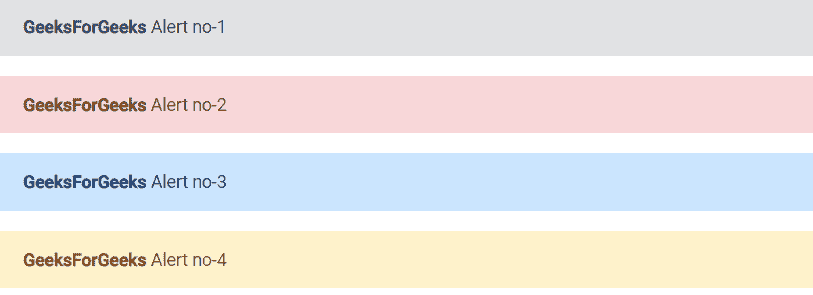

# Angular ngx Bootstrap Alerts 组件

> 原文：[https://www.geeksforgeeks.org/angular-ngx-bootstrap-alerts-component/](https://www.geeksforgeeks.org/angular-ngx-bootstrap-alerts-component/)

Angular ngx bootstrap 是一个 Bootstrap 框架，与 Angular 一起使用，用于创建具有优良样式的组件。该框架非常易于使用，适用于制作响应式网站。

在本文中，我们将了解如何在 Angular ngx bootstrap 中使用 alert。`Alert` 组件用于为少数可用的典型用户操作提供上下文反馈消息。

### 安装语法

```ts
npm install ngx-bootstrap --save
```

### 步骤

1.  首先，使用上述命令安装 Angular ngx bootstrap。
2.  在 `index.html` 中添加以下链接：
    > `<link href="https://maxcdn.bootstrapcdn.com/bootstrap/4.0.0/css/bootstrap.min.css" rel="stylesheet">`
3.  在模块中导入 `AlertModule` 组件。
4.  在 `app.component.html` 中创建一个 alert 组件。
5.  使用 `ng serve` 为应用提供服务。

## 示例 1

### index.html

```ts
<!doctype html>
<html lang="en">

<head>
    <meta charset="utf-8">
    <base href="/">
    <meta name="viewport" content="width=device-width, initial-scale=1">
    <link href="https://maxcdn.bootstrapcdn.com/bootstrap/4.0.0/css/bootstrap.min.css" rel="stylesheet">
    <link rel="icon" type="image/x-icon" href="favicon.ico">
    <link rel="preconnect" href="https://fonts.gstatic.com">
    <link href="https://fonts.googleapis.com/css2?family=Roboto:wght@300;400;500&display=swap" rel="stylesheet">
    <link href="https://fonts.googleapis.com/icon?family=Material+Icons" rel="stylesheet">
</head>

<body class="mat-typography">
    <app-root></app-root>
</body>

</html>
```

### app.component.html

```ts
<alert type="secondary">
    <strong>GeeksForGeeks</strong> Alert no-1
</alert>
<alert type="danger">
    <strong>GeeksForGeeks</strong> Alert no-2
</alert>
<alert type="primary">
    <strong>GeeksForGeeks</strong> Alert no-3
</alert>
<alert type="warning">
    <strong>GeeksForGeeks</strong> Alert no-4
</alert>
```

### app.module.ts

```ts
import { NgModule } from '@angular/core';
import { FormsModule, ReactiveFormsModule } from '@angular/forms';
import { BrowserModule } from '@angular/platform-browser';
import { BrowserAnimationsModule } from '@angular/platform-browser/animations';
import { AlertModule } from 'ngx-bootstrap/alert';
import { AppComponent } from './app.component';

@NgModule({
    bootstrap: [AppComponent],
    declarations: [AppComponent],
    imports: [
        FormsModule,
        BrowserModule,
        BrowserAnimationsModule,
        ReactiveFormsModule,
        AlertModule.forRoot()
    ]
})
export class AppModule { }
```

### 输出



### 参考

[https://valor-software.com/ngx-bootstrap/#/alerts](https://valor-software.com/ngx-bootstrap/#/alerts)