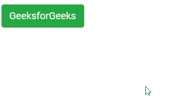

# Angular ngx Bootstrap Tooltip 组件

> 原文：[https://www.geeksforgeeks.org/angular-ngx-bootstrap-tooltip-component/](https://www.geeksforgeeks.org/angular-ngx-bootstrap-tooltip-component/)

Angular ngx bootstrap 是一个 bootstrap 框架，与 Angular 一起使用，用于创建具有优良样式的组件。该框架非常易于使用，适用于制作响应式网站。

在本文中，我们将看到如何在 Angular ngx bootstrap 中使用 Tooltip。

## 安装语法

```ts
npm install ngx-bootstrap --save
```

## 进程

*   首先，使用上述命令安装 Angular ngx bootstrap。
*   在 `index.html` 中添加以下链接：
    > <link href="https://maxcdn.bootstrapcdn.com/bootstrap/4.0.0/css/bootstrap.min.css" rel="stylesheet">
*   在模块中导入工具提示组件。
*   在 `app.component.html` 中创建一个工具提示组件。
*   使用 `ng serve` 为应用提供服务。

## 示例

### index.html

```ts
<!DOCTYPE html>
<html lang="en">

<head>
    <meta charset="utf-8" />
    <title>Demo</title>
    <base href="/" />
    <meta name="viewport" content="width=device-width, initial-scale=1" />
    <link href="https://maxcdn.bootstrapcdn.com/bootstrap/4.0.0/css/bootstrap.min.css" rel="stylesheet" />
    <link rel="icon" type="image/x-icon" href="favicon.ico" />
    <link rel="preconnect" href="https://fonts.gstatic.com" />
    <link href="https://fonts.googleapis.com/css2?family=Roboto:wght@300;400;500&display=swap" rel="stylesheet" />
    <link href="https://fonts.googleapis.com/icon?family=Material+Icons" rel="stylesheet" />
</head>

<body class="mat-typography">
    <app-root></app-root>
</body>

</html>
```

### app.component.html

```ts
<button id='gfg' type="button" class="btn btn-success" tooltip="Tooltip component in Angular ngx bootstrap.">
    GeeksforGeeks
</button>
```

### app.module.ts

```ts
import { NgModule } from '@angular/core';
import { FormsModule, ReactiveFormsModule } from '@angular/forms';
import { BrowserModule } from '@angular/platform-browser';
import { BrowserAnimationsModule } from '@angular/platform-browser/animations';
import { TooltipModule } from 'ngx-bootstrap/tooltip';
import { AppComponent } from './app.component';

@NgModule({
  bootstrap: [AppComponent],
  declarations: [AppComponent],
  imports: [
    FormsModule,
    BrowserModule,
    BrowserAnimationsModule,
    ReactiveFormsModule,
    TooltipModule.forRoot()
  ]
})
export class AppModule { }
```

### app.component.css

```ts
#gfg {
    margin: 10px;
}
```

### app.component.ts

```ts
import { Component } from '@angular/core';

@Component({
    selector: 'app-root',
    templateUrl: './app.component.html',
    styleUrls: ['./app.component.css']
})
export class AppComponent {
}
```

## 输出

