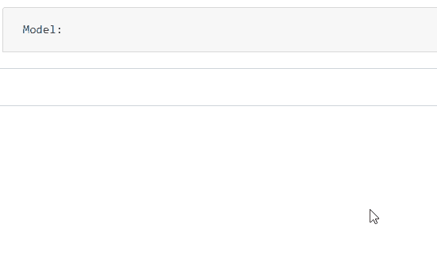

# Angular ngx Bootstrap Typeahead 组件

> 原文: [https://www.geeksforgeeks.org/angular-ngx-bootstrap-typeahead-component/](https://www.geeksforgeeks.org/angular-ngx-bootstrap-typeahead-component/)

Angular ngx bootstrap 是一个 Bootstrap 框架，与 Angular 一起使用来创建具有很好风格的组件。这个框架非常容易使用，用于制作响应性网站。
在本文中，我们将了解如何在 Angular ngx bootstrap 中使用 typeahead。

### 安装语法

```ts
npm install ngx-bootstrap --save
```

### 步骤

1.  首先，使用上述命令安装 Angular ngx bootstrap。
2.  在 `index.html` 添加以下脚本：
    > <link href="https://maxcdn.bootstrapcdn.com/bootstrap/4.0.0/css/bootstrap.min.css" rel="stylesheet">
3.  在模块中导入 `TypeaheadModule` 组件（`app.module.ts`）。
4.  在 `app.component.html`，制作一个 typeahead 组件。
5.  使用 `ng serve` 为应用提供服务。

### 示例 1

#### index.html

```ts
<!doctype html>
<html lang="en">

<head>
    <meta charset="utf-8">
    <title>Demo</title>
    <base href="/">
    <meta name="viewport" content="width=device-width, initial-scale=1">
    <link href="https://maxcdn.bootstrapcdn.com/bootstrap/4.0.0/css/bootstrap.min.css" rel="stylesheet">
    <link rel="icon" type="image/x-icon" href="favicon.ico">
    <link rel="preconnect" href="https://fonts.gstatic.com">
    <link href="https://fonts.googleapis.com/css2?family=Roboto:wght@300;400;500&display=swap" rel="stylesheet">
    <link href="https://fonts.googleapis.com/icon?family=Material+Icons" rel="stylesheet">
</head>

<body class="mat-typography">
    <app-root></app-root>
</body>

</html>
```

#### app.component.html

```ts
<pre id='gfg1' class="card card-block card-header mb-3">
    Model: {{gfg | json}}
</pre>

<input [(ngModel)]="gfg" [typeahead]="geeks" class="form-control">
```

#### app.module.ts

```ts
import { NgModule } from '@angular/core';
import { FormsModule, ReactiveFormsModule } from '@angular/forms';
import { BrowserModule } from '@angular/platform-browser';
import { BrowserAnimationsModule } from '@angular/platform-browser/animations';
import { TypeaheadModule } from 'ngx-bootstrap/typeahead';
import { AppComponent } from './app.component';

@NgModule({
  bootstrap: [AppComponent],
  declarations: [AppComponent],
  imports: [
    FormsModule,
    BrowserModule,
    BrowserAnimationsModule,
    ReactiveFormsModule,
    TypeaheadModule.forRoot()
  ]
})
export class AppModule { }
```

#### app.component.css

```ts
#gfg1 {
    margin: 10px;
}
```

#### app.component.ts

```ts
import { Component, OnInit, LOCALE_ID } from '@angular/core';

@Component({
    selector: 'app-root',
    templateUrl: './app.component.html',
    styleUrls: ['./app.component.css']
})
export class AppComponent {
    'gfg': string;
    geeks: string[] = [
        'HTML',
        'JavaScript',
        'Java',
        'AngularJS',
        'ReactJS',
        'Bootstrap'
    ];
}
```

### 输出

