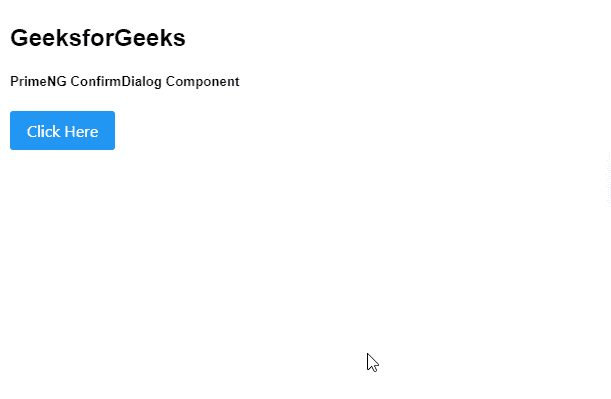

# Angular PrimeNG ConfirmDialog 组件

> 原文: [https://www.geeksforgeeks.org/angular-primeng-confirmdialog-component/](https://www.geeksforgeeks.org/angular-primeng-confirmdialog-component/)

Angular PrimeNG 是一个与 Angular 一起使用的框架，用来创建具有很好样式的组件，这个框架非常易于使用，用于制作响应性网站。

在本文中，我们将了解如何在 Angular PrimeNG 中使用 ConfirmDialog 组件。ConfirmDialog 组件用于制作包含确认按钮的对话框来确认操作。

### 属性

*   `message`: 是确认的消息。为字符串数据类型，默认值为空。
*   `key`: 是可选键，匹配确认对话框的键。为字符串数据类型，默认值为空。
*   `icon`: 是显示在消息旁边的图标。为字符串数据类型，默认值为空。
*   `header`: 是对话框的表头文本。为字符串数据类型，默认值为空。
*   `accept`: 确认动作时执行的回调。
*   `reject`: 动作被拒绝时执行的回调。
*   `acceptLabel`: 是接受按钮的标签。为字符串数据类型，默认值为空。
*   `rejectLabel`: 是拒绝按钮的标签。为字符串数据类型，默认值为空。
*   `acceptIcon`: 是接受按钮的图标。为字符串数据类型，默认值为空。
*   `rejectIcon`: 是拒绝按钮的图标。为字符串数据类型，默认值为空。
*   `acceptButtonStyleClass`: 用于设置接受按钮的 Style class。为字符串数据类型，默认值为空。
*   `rejectButtonStyleClass`: 用于设置拒绝按钮的样式类。为字符串数据类型，默认值为空。
*   `acceptVisible`: 用于设置接受按钮的可见性。为布尔数据类型，默认值为 `false`。
*   `rejectVisible`: 用于设置拒绝按钮的可见性。为布尔数据类型，默认值为 `false`。
*   `style`: 是组件的内联样式。为对象数据类型，默认值为空。
*   `styleClass`: 它是组件的 Style class。为字符串数据类型，默认值为空。
*   `maskStyleClass`: 是遮罩层的风格类。为字符串数据类型，默认值为空。
*   `blockScroll`: 用于在对话框可见时指定是否要阻止背景滚动。为布尔数据类型，默认值为 `false`。
*   `closeOnEscape`: 它指定按下 Escape 键是否应该隐藏对话框。为布尔数据类型，默认值为 `false`。
*   `dismissableMask`: 它指定单击模态背景是否应该隐藏对话框。为布尔数据类型，默认值为 `false`。
*   `defaultFocus`: 当对话框可见时，指定哪个元素接收焦点。

### 事件

*   `onHide`: 是对话框隐藏时触发的回调。

### 创建 Angular 应用并安装模块

*   **步骤 1:** 使用以下命令创建 Angular 应用程序。

```ts
ng new appname
```

*   **步骤 2:** 创建项目文件夹即 `appname` 后，使用以下命令移动到该文件夹。

```ts
cd appname
```

*   **步骤 3:** 在给定的目录中安装 PrimeNG。

```ts
npm install primeng --save
npm install primeicons --save
```

### 项目结构

项目结构如下图所示。


### 示例

这是展示如何使用 ConfirmDialog 组件的基本示例。

#### app.component.html

```ts
<h2>GeeksforGeeks</h2>
<h5>PrimeNG ConfirmDialog Component</h5>
<p-confirmDialog [style]="{width: '60vw'}"></p-confirmDialog>
<p-button (click)="GetConfirm()" label="Click Here"></p-button>
```

#### app.module.ts

```ts
import { NgModule } from '@angular/core';
import { BrowserModule } from '@angular/platform-browser';
import {BrowserAnimationsModule}
      from '@angular/platform-browser/animations';

import { AppComponent }   from './app.component';

import { ButtonModule } from 'primeng/button';
import { ConfirmDialogModule } from 'primeng/confirmdialog';

@NgModule({
  imports: [
    BrowserModule,
    BrowserAnimationsModule,
    ConfirmDialogModule,
    ButtonModule,
  ],
  declarations: [ AppComponent ],
  bootstrap:    [ AppComponent ]
})

export class AppModule { }
```

#### app.component.ts

```ts
import { Component } from '@angular/core';
import {ConfirmationService} from 'primeng/api';
import { PrimeNGConfig } from 'primeng/api';

@Component({
  selector: 'app-root',
  templateUrl: './app.component.html',
  styles: [],
  providers: [ConfirmationService]
})
export class AppComponent {

constructor(private confirmationService: ConfirmationService,
    private primengConfig: PrimeNGConfig) {}

GetConfirm() {
        this.confirmationService.confirm({
            message: 'Angular PrimeNG ConfirmDialog Component',
            header: 'GeeksforGeeks',
        });
    }
}
```

### 输出

输出结果如下图所示。



### 参考

[https://primefaces.org/primeng/showcase/#/confirmdialog](https://primefaces.org/primeng/showcase/#/confirmdialog)