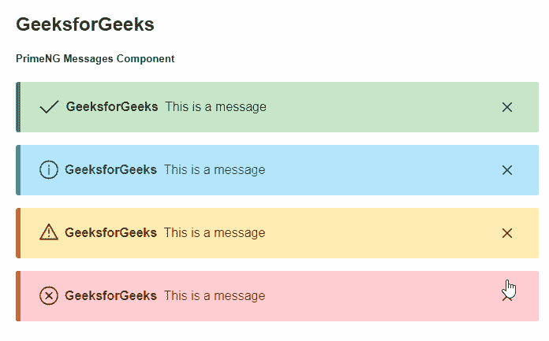
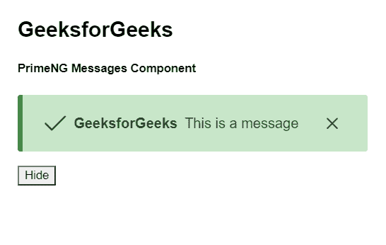

# Angular PrimeNG 消息组件

> 原文：[https://www.geeksforgeeks.org/angular-primeng-messages-component/](https://www.geeksforgeeks.org/angular-primeng-messages-component/)

Angular PrimeNG 是一个开源框架，具有一组丰富的本机 Angular UI 组件，用于实现出色的风格，该框架用于非常轻松地制作响应性网站。在本文中，我们将了解如何在 Angular PrimeNG 中使用消息组件。我们还将了解将在代码中使用的属性、样式及其语法。

## 消息组件

用于显示具有特定严重性的消息。

## 消息组件的属性

*   `value`: 是要显示的消息数组。它属于数组数据类型，默认值为 `null`。
*   `closable`: 定义消息框是否可以通过点击图标关闭。它属于布尔数据类型，默认值为 `true`。
*   `style`: 设置组件的内联样式。它是字符串数据类型，默认值为 `null`。
*   `styleClass`: 设置组件的样式类。它是字符串数据类型，默认值为 `null`。
*   `enableService`: 指定是否启用显示服务消息。它属于布尔数据类型，默认值为 `true`。
*   `escape`: 指定显示消息是否会被转义。它是布尔数据类型，默认值为 `true`。
*   `key`: 它是与消息的键匹配的 Id，以便在基于服务的消息传递中启用范围。它是字符串数据类型，默认值为 `null`。
*   `showTransitionOptions`: 设置显示动画的过渡选项。它属于字符串数据类型，默认值为 `'300ms'`。
*   `hideTransitionOptions`: 设置隐藏动画的过渡选项。它属于字符串数据类型，默认值为 `'200ms cubic-bezier(0.86, 0, 0.07, 1)'`。

## 消息组件的样式

*   `p-messages`: 它是一个容器元素。
*   `p-message`: 它是一个消息元素。
*   `p-message-info`: 显示信息消息时的消息元素。
*   `p-message-warn`: 显示警告消息时的消息元素。
*   `p-message-error`: 显示错误消息时的消息元素。
*   `p-message-success`: 显示成功消息时的消息元素。
*   `p-message-close`: 是关闭按钮。
*   `p-message-close-icon`: 是关闭图标。
*   `p-message-icon`: 是严重性图标。
*   `p-message-summary`: 是一条消息的摘要。
*   `p-message-detail`: 是一条消息的细节。

## 内联消息组件的属性

*   `severity`: 用于指定消息的严重程度。它是字符串数据类型，默认值为 `null`。
*   `text`: 用于设置文本内容。它是字符串数据类型，默认值为 `null`。
*   `escape`: 显示消息是否会被转义。布尔值 `true`。
*   `style`: 用于设置组件的内联样式。它是字符串数据类型，默认值为 `null`。
*   `styleClass`: 用于设置组件的样式类。它是字符串数据类型，默认值为 `null`。

## 内联消息组件的样式

*   `p-inline-message`: 是一个消息元素。
*   `p-inline-message-info`: 显示信息消息时的消息元素。
*   `p-inline-message-warn`: 显示警告消息时的消息元素。
*   `p-inline-message-error`: 显示错误消息时的消息元素。
*   `p-inline-message-success`: 显示成功消息时的消息元素。
*   `p-inline-message-icon`: 用于指定严重性图标。
*   `p-inline-message-text`: 是一条短信。

## 创建 Angular 应用 & 模块安装

### 步骤 1
使用以下命令创建 Angular 应用程序。
```bash
ng new appname
```

### 步骤 2
创建项目文件夹即 `appname` 后，使用以下命令移动到该文件夹。
```bash
cd appname
```

### 步骤 3
在给定的目录中安装 PrimeNG。
```bash
npm install primeng --save
npm install primeicons --save
```

## 项目结构
如下图：


## 示例 1
这是说明如何使用 `Messages` 组件的基本示例。

### `app.component.html`
```html
<h2>GeeksforGeeks</h2>
<h5>PrimeNG Messages Component</h5>
<p-messages [(value)]="gfg" 
  [enableService]="false">
</p-messages>
```

### `app.component.ts`
```typescript
import { Component } from "@angular/core";
import { Message } from "primeng/api";

@Component({
  selector: "my-app",
  templateUrl: "./app.component.html",
})
export class AppComponent {
  gfg: Message[];

  ngOnInit() {
    this.gfg = [
      { detail: "This is a message" },
      { detail: "This is a message" },
      { detail: "This is a message" },
      { detail: "This is a message" },
    ];
  }
}
```

### `app.module.ts`
```typescript
import { NgModule } from "@angular/core";
import { BrowserModule } from "@angular/platform-browser";
import { BrowserAnimationsModule } 
    from "@angular/platform-browser/animations";

import { AppComponent } from "./app.component";
import { MessagesModule } from "primeng/messages";
import { MessageModule } from "primeng/message";

@NgModule({
  imports: [
    BrowserModule,
    BrowserAnimationsModule,
    MessagesModule,
    MessageModule,
  ],
  declarations: [AppComponent],
  bootstrap: [AppComponent],
})
export class AppModule {}
```

**输出：**


## 示例 2
在本例中，我们已经使用按钮清除了消息。

### `app.component.html`
```html
<h2>GeeksforGeeks</h2>
<h5>PrimeNG Messages Component</h5>
<p-messages [(value)]="msgs"></p-messages>
<button type="button" (click)="hide()">Hide</button>
```

### `app.component.ts`
```typescript
import { Component } from "@angular/core";
import { Message } from "primeng/api";

@Component({
  selector: "my-app",
  templateUrl: "./app.component.html",
})
export class AppComponent {
  msgs = [
    {
      severity: "success",
      summary: "GeeksforGeeks",
      detail: "This is a message",
    },
  ];
  hide() {
    this.msgs = [];
  }
  ngOnInit() {}
}
```

### `app.module.ts`
```typescript
import { NgModule } from "@angular/core";
import { BrowserModule } from "@angular/platform-browser";
import { BrowserAnimationsModule } 
    from "@angular/platform-browser/animations";

import { AppComponent } from "./app.component";
import { MessagesModule } from "primeng/messages";
import { MessageModule } from "primeng/message";

@NgModule({
  imports: [
    BrowserModule,
    BrowserAnimationsModule,
    MessagesModule,
    MessageModule,
  ],
  declarations: [AppComponent],
  bootstrap: [AppComponent],
})
export class AppModule {}
```

**输出：**


**参考：** [https://primefaces.org/primeng/showcase/#/messages](https://primefaces.org/primeng/showcase/#/messages)