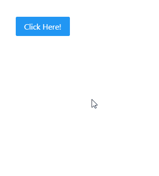

# Angular PrimeNG 侧边栏组件

> 原文: [https://www.geeksforgeeks.org/angular-primeng-sidebar-component/](https://www.geeksforgeeks.org/angular-primeng-sidebar-component/)

Angular PrimeNG 是一个开源框架，具有一组丰富的本机 Angular UI 组件，用于实现出色的风格，该框架用于非常轻松地制作响应性网站。在本文中，我们将了解如何在 Angular PrimeNG 中使用侧边栏组件。我们还将了解将在代码中使用的属性、事件和样式以及它们的语法。

**侧边栏组件:** 它用于制作覆盖在屏幕边缘的元素。

## 属性

*   `visible`: 指定对话框的可见性。它属于布尔数据类型，默认值为 `false`。
*   `position`: 指定侧边栏的位置，有效值为 `"left"`、`"right"`、`"bottom"`、`"top"`。它是字符串数据类型 & 默认值为 `left`。
*   `fullScreen`: 用于在表头增加关闭图标，隐藏对话框。它是布尔数据类型 & 默认值为 `false`。
*   `appendTo`: 是附加对话框的目标元素，有效值为 `"body"` 或另一个元素的局部 `ng-template` 变量。它接受任何类型的数据 & 默认值为 `null`。
*   `style`: 用于设置组件的内嵌样式。它是字符串数据类型 & 默认值为 `null`。
*   `styleClass`: 用于设置组件的样式类。它是字符串数据类型 & 默认值为 `null`。
*   `blockScroll`: 用于指定侧边栏活动时是否阻止文档滚动。它是布尔数据类型 & 默认值为 `false`。
*   `baseZIndex`: 用于设置分层时使用的 `baseZIndex` 值。它是数字数据类型 & 默认值为 `0`。
*   `autoZIndex`: 用于指定是否自动管理分层。它属于布尔数据类型，默认值为 `true`。
*   `modal`: 用于指定侧边栏后面是否显示覆盖遮罩。它属于布尔数据类型，默认值为 `true`。
*   `dismissable`: 用于指定点击蒙版是否解除侧边栏。它属于布尔数据类型，默认值为 `true`。
*   `showCloseIcon`: 用于指定是否显示关闭图标。它是布尔数据类型，默认值为 `true`。
*   `transitionOptions`: 用于设置动画的过渡选项。它是字符串数据类型 & 默认值是 `150ms cubic-bezier(0, 0, 0.2, 1)`。
*   `ariaCloseLabel`: 用于设置关闭图标的 `aria-label`。它是字符串数据类型 & 默认值是 `close`。
*   `closeOnEscape`: 用于指定按下 `escape` 键是否应该隐藏侧边栏。它属于布尔数据类型，默认值为 `true`。

## 事件

*   `onShow`: 这是一个回调，在显示对话框时触发。
*   `onHide`: 这是一个在对话框隐藏时触发的回调。

## 样式

*   `p-sidebar`: 它是容器元素。
*   `p-sidebar-left`: 是左侧边栏的容器元素。
*   `p-sidebar-right`: 是右侧边栏的容器元素。
*   `p-sidebar-top`: 是顶部侧边栏的容器元素。
*   `p-sidebar-bottom`: 是底部侧边栏的容器元素。
*   `p-sidebar-full`: 它是全屏侧边栏的容器元素。
*   `p-sidebar-active`: 侧边栏可见时是容器元素。
*   `p-sidebar-close`: 是关闭锚点元素。
*   `p-sidebar-sm`: 是一个小尺寸的侧边栏。
*   `p-sidebar-md`: 是中型侧边栏。
*   `p-sidebar-lg`: 是大尺寸侧边栏。
*   `p-sidebar-mask`: 是侧边栏的模态层。

## 创建 Angular 应用 & 模块安装

*   **步骤 1:** 使用以下命令创建 Angular 应用程序。

```ts
ng new appname
```

*   **步骤 2:** 创建项目文件夹即 `appname` 后，使用以下命令移动到该文件夹。

```ts
cd appname
```

*   **步骤 3:** 在给定的目录中安装 PrimeNG。

```ts
npm install primeng --save
npm install primeicons --save
```

## 项目结构

如下图:


### 示例 1

这是说明如何使用侧边栏组件的基本示例。

#### app.component.html

```ts
<p-sidebar [(visible)]="gfg" [baseZIndex]="10000">
  <h1 style="font-weight: normal">GeeksforGeeks</h1>
  <p>Angular PrimeNG Sidebar Component</p>
  <p-button
    type="button"
    (click)="gfg = false"
    label="OK"
    styleClass="p-button-info">
  </p-button>
  <p-button
    type="button"
    (click)="gfg = false"
    label="Cancel"
    styleClass="p-button-danger">
  </p-button>
</p-sidebar>
<p-button (click)="gfg = true"
          label="Click Here!">
</p-button>
```

#### app.component.ts

```ts
import { Component } from '@angular/core';

@Component({
  selector: 'my-app',
  templateUrl: './app.component.html',
  styleUrls: ['./app.component.scss']
})
export class AppComponent {}
```

#### app.module.ts

```ts
import { NgModule } from "@angular/core";
import { BrowserModule } from "@angular/platform-browser";
import { BrowserAnimationsModule } from "@angular/platform-browser/animations";

import { AppComponent } from "./app.component";
import { ButtonModule } from "primeng/button";
import { SidebarModule } from "primeng/sidebar";

@NgModule({
  imports: [
    BrowserModule,
    BrowserAnimationsModule,
    SidebarModule,
    ButtonModule,
  ],
  declarations: [AppComponent],
  bootstrap: [AppComponent],
})
export class AppModule {}
```

**输出:**



### 示例 2

在本例中，我们将了解如何在侧边栏组件中使用 `position` 属性。

#### app.component.html

```ts
<p-sidebar [(visible)]="gfg"
          [baseZIndex]="10000" position="right">
  <h1 style="font-weight: normal">GeeksforGeeks</h1>
  <p>Angular PrimeNG Sidebar Component</p>
  <p-button
    type="button"
    (click)="gfg = false"
    label="OK"
    styleClass="p-button-info">
  </p-button>
  <p-button
    type="button"
    (click)="gfg = false"
    label="Cancel"
    styleClass="p-button-danger">
  </p-button>
</p-sidebar>
<p-button (click)="gfg = true"
          label="Click Here!">
</p-button>
```

#### app.component.ts

```ts
import { Component } from '@angular/core';

@Component({
  selector: 'my-app',
  templateUrl: './app.component.html',
  styleUrls: ['./app.component.scss']
})
export class AppComponent {}
```

#### app.module.ts

```ts
import { NgModule } from "@angular/core";
import { BrowserModule } from "@angular/platform-browser";
import { BrowserAnimationsModule } from "@angular/platform-browser/animations";

import { AppComponent } from "./app.component";
import { ButtonModule } from "primeng/button";
import { SidebarModule } from "primeng/sidebar";

@NgModule({
  imports: [
    BrowserModule,
    BrowserAnimationsModule,
    SidebarModule,
    ButtonModule,
  ],
  declarations: [AppComponent],
  bootstrap: [AppComponent],
})
export class AppModule {}
```

**输出:**


**参考:** [https://primefaces.org/primeng/showcase/#/sidebar](https://primefaces.org/primeng/showcase/#/sidebar)