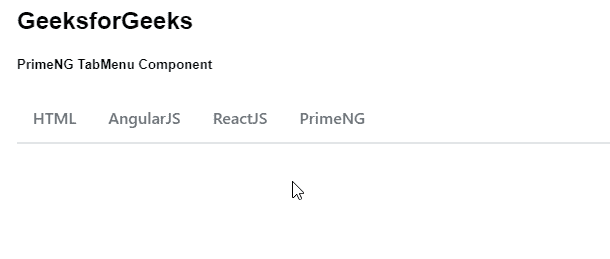
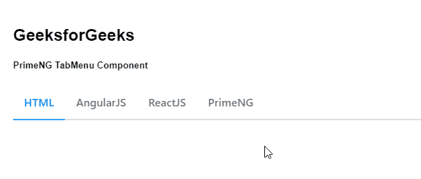

# Angular PrimeNG TabMenu 组件

> 原文: [https://www.geeksforgeeks.org/angular-primeng-tabmenu-component/](https://www.geeksforgeeks.org/angular-primeng-tabmenu-component/)

Angular PrimeNG 是一个开源框架，具有一组丰富的本机 Angular UI 组件，用于实现出色的风格。该框架用于非常轻松地制作响应性网站。在本文中，我们将了解如何在 Angular PrimeNG 中使用 `TabMenu` 组件。

## TabMenu 组件

用于制作导航栏，将导航项目显示为导航标题（即，它是选项卡形式的菜单）。

## 属性

*   `model`: 是一个菜单项的数组。它接受数组作为输入数据类型，默认值为空。
*   `activeItem`: 定义默认的激活菜单项。它接受菜单项作为输入类型，默认值为空。
*   `style`: 设置组件的内联样式。它接受字符串作为输入数据类型，默认值为空。
*   `styleClass`: 是组件的样式类。它接受字符串作为输入数据类型，默认值为空。

## 样式类

*   `p-tabmenu`: 是容器元素。
*   `p-tabmenu-nav`: 是表头的列表元素。
*   `p-tabmenuitem`: 是菜单项的一个元素。
*   `p-menuitem-link`: 是菜单项内部的链接。
*   `p-menuitem-text`: 是菜单项的标签。
*   `p-menuitem-icon`: 是一个菜单项的图标。

## 创建 Angular 应用及模块安装

### 步骤 1

使用以下命令创建 Angular 应用程序。

```ts
ng new appname
```

### 步骤 2

创建项目文件夹（即 `appname`）后，使用以下命令移动到该文件夹。

```ts
cd appname
```

### 步骤 3

在给定的目录下安装 PrimeNG。

```ts
npm install primeng --save
npm install primeicons --save
```

### 项目结构

安装完成后，如下图：


## 示例 1

这是展示如何使用 `TabMenu` 组件的基本示例。

### app.component.html

```ts
<h2>GeeksforGeeks</h2>
<h5>PrimeNG TabMenu Component</h5>
<p-tabMenu [model]="gfg"></p-tabMenu>
```

### app.component.ts

```ts
import { Component } from '@angular/core';
import { MenuItem } from 'primeng/api';

@Component({
  selector: 'my-app',
  templateUrl: './app.component.html'
})
export class AppComponent {
  gfg: MenuItem[];

  ngOnInit() {
    this.gfg = [
      {
        label: 'HTML'
      },
      {
        label: 'AngularJS'
      },
      {
        label: 'ReactJS'
      },
      {
        label: 'PrimeNG'
      }
    ];
  }
}
```

### app.module.ts

```ts
import { NgModule } from '@angular/core';
import { BrowserModule } from '@angular/platform-browser';
import { RouterModule } from '@angular/router';
import { BrowserAnimationsModule } from '@angular/platform-browser/animations';

import { AppComponent } from './app.component';
import { TabMenuModule } from 'primeng/tabmenu';

@NgModule({
  imports: [
    BrowserModule,
    BrowserAnimationsModule,
    TabMenuModule,
    RouterModule.forRoot([{ path: '', component: AppComponent }])
  ],
  declarations: [AppComponent],
  bootstrap: [AppComponent]
})
export class AppModule {}
```

### 输出



## 示例 2

在本例中，第一项（即 `HTML`）在这种情况下，首次加载页面时会预先选择。

### app.component.html

```ts
<h2>GeeksforGeeks</h2>
<h5>PrimeNG TabMenu Component</h5>
<p-tabMenu [model]="gfg" [activeItem]="activeItem"></p-tabMenu>
```

### app.component.ts

```ts
import { Component } from '@angular/core';
import { MenuItem } from 'primeng/api';

@Component({
  selector: 'my-app',
  templateUrl: './app.component.html'
})
export class AppComponent {
  gfg: MenuItem[];

  activeItem: MenuItem;

  ngOnInit() {
    this.gfg = [
      {
        label: 'HTML'
      },
      {
        label: 'AngularJS'
      },
      {
        label: 'ReactJS'
      },
      {
        label: 'PrimeNG'
      }
    ];

    this.activeItem = this.gfg[0];
  }
}
```

### app.module.ts

```ts
import { NgModule } from '@angular/core';
import { BrowserModule } from '@angular/platform-browser';
import { RouterModule } from '@angular/router';
import { BrowserAnimationsModule } from '@angular/platform-browser/animations';

import { AppComponent } from './app.component';
import { TabMenuModule } from 'primeng/tabmenu';

@NgModule({
  imports: [
    BrowserModule,
    BrowserAnimationsModule,
    TabMenuModule,
    RouterModule.forRoot([{ path: '', component: AppComponent }])
  ],
  declarations: [AppComponent],
  bootstrap: [AppComponent]
})
export class AppModule {}
```

### 输出



## 参考

[https://primefaces.org/primeng/showcase/#/tabmenu](https://primefaces.org/primeng/showcase/#/tabmenu)