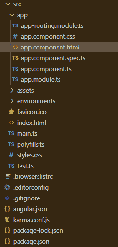
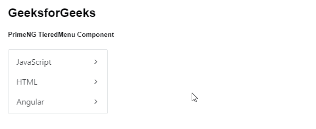
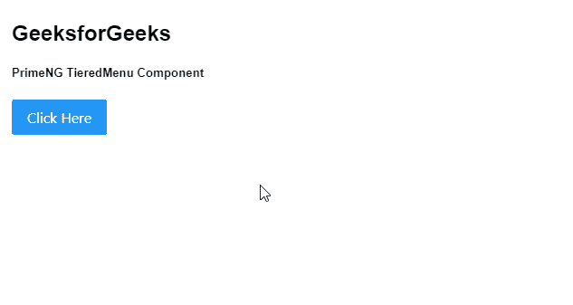

# Angular PrimeNG TieredMenu 组件

> 原文: [https://www.geeksforgeeks.org/angular-primeng-tieredmenu-component/](https://www.geeksforgeeks.org/angular-primeng-tieredmenu-component/)

Angular PrimeNG 是一个开源框架，具有一组丰富的原生 Angular UI 组件，用于实现出色的风格。该框架用于非常轻松地制作响应式网站。在本文中，我们将了解如何在 Angular PrimeNG 中使用 `TieredMenu` 组件。我们还将了解将在代码中使用的属性、方法、样式以及它们的语法。

## 分层菜单组件

允许用户以分层的形式制作菜单。

## 属性

*   `model`: 是一个菜单项的数组。它是数组数据类型 & 默认值为空。
*   `popup`: 定义菜单是否显示为弹出菜单。它属于布尔数据类型 & 默认值为 `false`。
*   `appendTo`: 指定要附加叠加层的目标元素 & 有效值为 `"body"` 或另一个元素的局部 `ng-template` 变量。属于数组数据类型 & 默认值为空。
*   `style`: 设置组件的内联样式。它是字符串数据类型 & 默认值为空。
*   `styleClass`: 设置组件的样式类。它接受字符串数据类型 & 默认值为空。
*   `baseZIndex`: 是一个用于分层的基 `zIndex` 值。它接受数字作为输入数据类型 & 默认值为 `0`。
*   `autoZIndex`: 指定是否自动管理分层。它属于布尔数据类型 & 默认值为 `true`。
*   `autoShow`: 指定是否在鼠标悬停时显示根子菜单。它属于布尔数据类型 & 默认值为 `false`。
*   `showTransitionOptions`: 显示过渡选项来显示动画。它接受字符串数据类型 & 默认值为 `.12s cubic-bezier(0, 0, 0.2, 1)`。
*   `hideTransitionOptions`: 显示隐藏动画的过渡选项。它接受字符串数据类型 & 默认值为 `.1s linear`。

## 方法

*   `toggle()`: 用于切换弹出菜单的可见性。
*   `show()`: 用于显示弹出菜单。
*   `hide()`: 用于隐藏弹出菜单。

## 样式

*   `.p-tieredmenu`: 是容器元素。
*   `.p-menu-list`: 是列表元素。
*   `.p-menuitem`: 是菜单项元素。
*   `.p-menuitem-text`: 是菜单项的标签。
*   `.p-menuitem-icon`: 是一个菜单项的图标。
*   `.p-submenu-icon`: 是一个子菜单的箭头图标。

## 创建 Angular 应用 & 模块安装

### 步骤 1
使用以下命令创建 Angular 应用程序:
```bash
ng new appname
```

### 步骤 2
创建项目文件夹即 `appname` 后，使用以下命令移动到该文件夹。
```bash
cd appname
```

### 步骤 3
在给定的目录中安装 PrimeNG。
```bash
npm install primeng --save
npm install primeicons --save
```

## 项目结构
安装完成后，如下图:



## 示例 1
这是展示如何使用 `TieredMenu` 组件的基本示例。

### app.component.html
```html
<h2>GeeksforGeeks</h2>
<h5>PrimeNG TieredMenu Component</h5>
<p-tieredMenu [model]="gfg"></p-tieredMenu>
```

### app.component.ts
```typescript
import { Component } from "@angular/core";
import { MenuItem } from "primeng/api";

@Component({
  selector: "my-app",
  templateUrl: "./app.component.html",
})
export class AppComponent {
  gfg: MenuItem[];

  ngOnInit() {
    this.gfg = [
      {
        label: "JavaScript",
        items: [
          {
            label: "JavaScript1",
            items: [
              {
                label: "JavaScript1.1",
              },
              {
                label: "JavaScript1.2",
              },
            ],
          },
          {
            label: "JavaScript2",
          },
          {
            label: "JavaScript3",
          },
        ],
      },
      {
        label: "HTML",
        items: [
          {
            label: "HTML 1",
          },
          {
            label: "HTML 2",
          },
        ],
      },
      {
        label: "Angular",
        items: [
          {
            label: "Angular 1",
          },
          {
            label: "Angular 2",
          },
        ],
      },
    ];
  }
}
```

### app.module.ts
```typescript
import { NgModule } from "@angular/core";
import { BrowserModule } from "@angular/platform-browser";
import { BrowserAnimationsModule } from "@angular/platform-browser/animations";

import { AppComponent } from "./app.component";
import { TieredMenuModule } from "primeng/tieredmenu";

@NgModule({
    imports: [BrowserModule,
              BrowserAnimationsModule,
              TieredMenuModule],
    declarations: [AppComponent],
    bootstrap: [AppComponent]
})
export class AppModule {}
```

## 输出


## 示例 2
在本例中，我们将使用弹出式菜单制作 `tieredmenu` 组件。

### app.component.html
```html
<h2>GeeksforGeeks</h2>
<h5>PrimeNG TieredMenu Component</h5>
<button #btn type="button" pButton label="Click Here"
        (click)="menu.toggle($event)"></button>
<p-tieredMenu #menu [model]="gfg" [popup]="true"></p-tieredMenu>
```

### app.component.ts
```typescript
import { Component } from '@angular/core';
import { MenuItem } from 'primeng/api';

@Component({
  selector: 'my-app',
  templateUrl: './app.component.html'
})
export class AppComponent {
  gfg: MenuItem[];

  ngOnInit() {
    this.gfg = [
      {
        label: 'JavaScript',
        items: [
          {
            label: 'JavaScript1',
            items: [
              {
                label: 'JavaScript1.1'
              },
              {
                label: 'JavaScript1.2'
              }
            ]
          },
          {
            label: 'JavaScript2'
          },
          {
            label: 'JavaScript3'
          }
        ]
      },
      {
        label: 'HTML',
        items: [
          {
            label: 'HTML 1'
          },
          {
            label: 'HTML 2'
          }
        ]
      },
      {
        label: 'Angular',
        items: [
          {
            label: 'Angular 1'
          },
          {
            label: 'Angular 2'
          }
        ]
      }
    ];
  }
}
```

### app.module.ts
```typescript
import { NgModule } from '@angular/core';
import { BrowserModule } from '@angular/platform-browser';
import { BrowserAnimationsModule } from '@angular/platform-browser/animations';

import { AppComponent } from './app.component';
import { TieredMenuModule } from 'primeng/tieredmenu';
import { ButtonModule } from 'primeng/button';

@NgModule({
  imports: [
    BrowserModule,
    BrowserAnimationsModule,
    TieredMenuModule,
    ButtonModule
  ],
  declarations: [AppComponent],
  bootstrap: [AppComponent]
})
export class AppModule {}
```

## 输出


## 参考
[TieredMenu - PrimeNG](https://primefaces.org/primeng/showcase/#/tieredmenu)