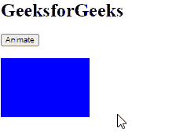

# Angular 10 `animate()` 函数

> 原文: [https://www.geeksforgeeks.org/angular10-animation-animate-function/](https://www.geeksforgeeks.org/angular10-animation-animate-function/)

在本文中，我们将看到 Angular 10 中什么是动画，以及如何使用它。

Angular 10 中的 `animate()` 用于定义一个动画步骤，该动画步骤将样式信息和时间信息结合在一起。

## 语法

```ts
animate(timings | styles)
```

## 模块

动画使用的模块是 `@angular/animations`。

## 进场

1.  创建要使用的 Angular 应用程序。
2.  在 `app.module.ts` 中导入 `BrowserAnimationsModule`。
3.  在 `app.component.html` 制作一个包含动画元素的 `div`。
4.  在 `app.component.ts` 中导入要使用的 `trigger`、`state`、`style`、`transition`、`animate`。
5.  使用包含定时和样式的 `animate()` 制作动画。
6.  使用 `ng serve` 为 Angular 应用服务，以查看输出。

## 参数

*   `timings`: 为父动画设置动画定时。
*   `styles`: 为父动画设置动画样式。

## 返回值

*   `AnimationAnimateMetadata`: 封装动画步骤的对象。

## 例 1

### `app.module.ts`

```ts
import { LOCALE_ID, NgModule } from '@angular/core';
import { BrowserModule } from '@angular/platform-browser';
import { BrowserAnimationsModule } from '@angular/platform-browser/animations';
import { AppRoutingModule } from './app-routing.module';
import { AppComponent } from './app.component';

@NgModule({
  declarations: [
    AppComponent
  ],
  imports: [
    BrowserModule,
    AppRoutingModule,
    BrowserAnimationsModule
  ],
  providers: [
    { provide: LOCALE_ID, useValue: 'en-GB' },
  ],
  bootstrap: [AppComponent]
})
export class AppModule { }
```

### `app.component.ts`

```ts
import { trigger, state, style, transition, animate } from '@angular/animations';
import { Component } from '@angular/core';

@Component({
  selector: 'app-root',
  templateUrl: './app.component.html',
  styleUrls: ['./app.component.css'],
  animations: [
    trigger('gfg', [
      state('normal', style({
        'background-color': 'red',
        transform: 'translateX(0)'
      })),
      state('highlighted', style({
        'background-color': 'blue',
        transform: 'translateX(0)'
      })),
      transition('normal => highlighted', animate(1200)),
      transition('highlighted => normal', animate(1000))
    ])
  ]
})
export class AppComponent {
  state = 'normal';
  anim() {
    this.state == 'normal' ?
      this.state = 'highlighted' : this.state = 'normal';
  }
}
```

### `app.component.html`

```html
<h1>GeeksforGeeks</h1>
<button (click)='anim()'>Animate</button>
<div
  style="width: 100px; height: 100px"
  [@gfg]='state'>
</div>
```

## 输出



## 参考

[https://angular.io/api/animations/animate](https://angular.io/api/animations/animate)