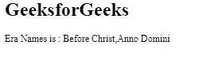

# Angular 10 getLocaleEraNames() 函数

> 原文: [https://www.geeksforgeeks.org/angular10-getlocaleeranames-function/](https://www.geeksforgeeks.org/angular10-getlocaleeranames-function/)

在本文中，我们将看到 Angular 10 中的 `getLocaleEraNames` 是什么以及如何使用它。

`getLocaleEraNames` 用于获取给定地区的公历纪元。

**语法:**

```ts
getLocaleEraNames(locale: string, width: TranslationWidth)
```

**模块:**
`getLocaleEraNames` 使用的模块为:
* `CommonModule`

**步骤:**
* 创建要使用的 Angular 应用程序。
* 在 `app.module.ts` 中导入 `LOCALE_ID`，因为我们需要使用 `getLocaleEraNames` 导入区域设置。

```ts
import { LOCALE_ID, NgModule } from '@angular/core';
```

* 在 `app.component.ts` 中，导入 `getLocaleEraNames` 和 `LOCALE_ID`。
* 将 `LOCALE_ID` 作为公共变量注入。
* 在 `app.component.html` 中，使用字符串插值显示局部变量。
* 使用 `ng serve` 为 Angular 应用服务，以查看输出。

**参数:**
* `locale`: 包含带有规则的区域设置代码的字符串。
* `width`: 字符宽度。

**返回值:**
* `Array`: 包含纪元名称的数组。

## 示例 1

### app.module.ts

```ts
import { LOCALE_ID, NgModule } from '@angular/core';
import { BrowserModule } from '@angular/platform-browser';

import { AppRoutingModule } from './app-routing.module';
import { AppComponent } from './app.component';

@NgModule({
  declarations: [
    AppComponent
  ],
  imports: [
    BrowserModule,
    AppRoutingModule
  ],
  providers: [
      { provide: LOCALE_ID, useValue: 'en-GB' },
  ],
  bootstrap: [AppComponent]
})
export class AppModule { }
```

### app.component.ts

```ts
import { FormStyle, getLocaleEraNames, TranslationWidth } from '@angular/common';
import { Component, Inject, OnInit, LOCALE_ID } from '@angular/core';

@Component({
    selector: 'app-root',
    templateUrl: './app.component.html'
})
export class AppComponent {
    code = getLocaleEraNames(this.locale, TranslationWidth.Wide);
    constructor(
        @Inject(LOCALE_ID) public locale: string,
    ){}
}
```

### app.component.html

```html
<h1>
   GeeksforGeeks
</h1>
<p>Era Names is : {{code}}</p>
```

**输出:**



## 示例 2

### app.module.ts

```ts
import { LOCALE_ID, NgModule } from '@angular/core';
import { BrowserModule } from '@angular/platform-browser';

import { AppRoutingModule } from './app-routing.module';
import { AppComponent } from './app.component';

@NgModule({
  declarations: [
    AppComponent
  ],
  imports: [
    BrowserModule,
    AppRoutingModule
  ],
  providers: [
      { provide: LOCALE_ID, useValue: 'en-GB' },
  ],
  bootstrap: [AppComponent]
})
export class AppModule { }
```

### app.component.ts

```ts
import { FormStyle, getLocaleEraNames, TranslationWidth } from '@angular/common';
import { Component, Inject, OnInit, LOCALE_ID } from '@angular/core';

@Component({
    selector: 'app-root',
    templateUrl: './app.component.html'
})
export class AppComponent {
    era = getLocaleEraNames(this.locale, TranslationWidth.Wide);
    a = '';
    b = '';
    constructor(
        @Inject(LOCALE_ID) public locale: string,
    ){
        if (this.era[0] == 'Before Christ') {
            this.a = 'BC';
            this.b = 'AD';
        }
    }
}
```

### app.component.html

```html
<h1>
   GeeksforGeeks
</h1>
<p>Era Names:
   <li>{{a}}</li>
   <li>{{b}}</li>
</p>
```

**输出:**


**参考:**
[https://angular.io/api/common/getLocaleEraNames](https://angular.io/api/common/getLocaleEraNames)