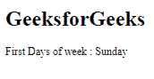
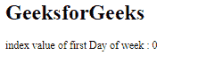

# Angular 10 `getLocaleFirstDayOfWeek()` 函数

> 原文: [https://www.geeksforgeeks.org/angular10-getlocalefirstdayofweek-function/](https://www.geeksforgeeks.org/angular10-getlocalefirstdayofweek-function/)

在本文中，我们将看到 Angular 10 中什么是 `getLocaleFirstDayOfWeek` 以及如何使用它。`getLocaleFirstDayOfWeek` 用于获取给定地区的一周的第一天。

## 语法

```ts
getLocaleFirstDayOfWeek(locale : string): WeekDay
```

## 模块

第一天使用的模块是 `CommonModule`。

## 进场

1.  创建 Angular 应用程序。
2.  在 `app.module.ts` 中，导入 `LOCALE_ID`，因为我们需要为使用 `getLocaleFirstDayOfWeek` 导入区域设置。
    ```ts
    import { LOCALE_ID, NgModule } from '@angular/core';
    ```
3.  在 `app.component.ts` 中，导入 `getLocaleFirstDayOfWeek` 和 `LOCALE_ID`。
4.  注入 `LOCALE_ID` 作为公共变量，并使用 `LOCALE` 变量编写获取一周第一天的代码。
5.  在 `app.component.html`，使用字符串插值显示局部变量。
6.  使用 `ng serve` 为 Angular 应用服务，以查看输出。

## 参数

*   `locale`: 有规则的地区代码。

## 返回值

*   `WeekDay`: 索引从 0 开始。

## 例 1

### app.module.ts

```ts
import { LOCALE_ID, NgModule } from '@angular/core';
import { BrowserModule } from '@angular/platform-browser';

import { AppRoutingModule } from './app-routing.module';
import { AppComponent } from './app.component';

@NgModule({
  declarations: [
    AppComponent
  ],
  imports: [
    BrowserModule,
    AppRoutingModule
  ],
  providers: [
      { provide: LOCALE_ID, useValue: 'en-GB' },
  ],
  bootstrap: [AppComponent]
})
export class AppModule { }
```

### app.component.ts

```ts
import { getLocaleFirstDayOfWeek } from '@angular/common';
import { Component, Inject, LOCALE_ID } from '@angular/core';

@Component({
    selector: 'app-root',
    templateUrl: './app.component.html'
})
export class AppComponent {
    day = getLocaleFirstDayOfWeek(this.locale);
    dd = '';
    constructor(
        @Inject(LOCALE_ID) public locale: string,){
            if(this.day==0){
                this.dd = 'Sunday';
            }
        }
}
```

### app.component.html

```html
<h1>
  GeeksforGeeks
</h1>

<p>First Days of week : {{dd}}</p>
```

**输出:**



## 例 2

### app.module.ts

```ts
import { LOCALE_ID, NgModule } from '@angular/core';
import { BrowserModule } from '@angular/platform-browser';

import { AppRoutingModule } from './app-routing.module';
import { AppComponent } from './app.component';

@NgModule({
  declarations: [
    AppComponent
  ],
  imports: [
    BrowserModule,
    AppRoutingModule
  ],
  providers: [
      { provide: LOCALE_ID, useValue: 'en-GB' },
  ],
  bootstrap: [AppComponent]
})
export class AppModule { }
```

### app.component.ts

```ts
import { getLocaleFirstDayOfWeek } from '@angular/common';
import { Component, Inject, LOCALE_ID } from '@angular/core';

@Component({
    selector: 'app-root',
    templateUrl: './app.component.html'
})
export class AppComponent {
    day = getLocaleFirstDayOfWeek(this.locale);
    constructor(
        @Inject(LOCALE_ID) public locale: string,){
        }
}
```

### app.component.html

```html
<h1>
  GeeksforGeeks
</h1>

<p>index value of first Day of week : {{day}}</p>
```

**输出:**



## 参考

[https://angular.io/api/common/getLocaleFirstDayOfWeek](https://angular.io/api/common/getLocaleFirstDayOfWeek)