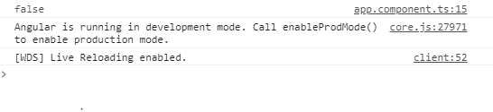
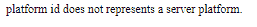

# Angular 10 `isPlatformServer()` 函数

> 原文: [https://www.geeksforgeeks.org/angular10-isplatformserver-function/](https://www.geeksforgeeks.org/angular10-isplatformserver-function/)

在本文中，我们将看到什么是 Angular 10 中的 `isPlatformServer` 以及如何使用它。

`isPlatformServer` 用于获取代表服务器平台的平台 ID。

## 语法

```typescript
isPlatformServer(platformId);
```

## 模块

`isPlatformServer` 使用的模块是 `公共模块`。

## 返回值

返回一个布尔值，说明一个平台 ID 是否代表一个服务器平台。

## 实现步骤

1.  创建要使用的 Angular 应用程序。
2.  将 `isPlatformServer` 从 `@angular/core` 导入项目。
3.  在 `app.component.ts` 中，定义保存布尔值的对象。
4.  使用 `ng serve` 为 Angular 应用提供服务，以查看输出。

## 示例 1

### app.component.ts

```typescript
import { Component, Inject } from '@angular/core';
import { PLATFORM_ID } from '@angular/core';
import { isPlatformServer } from '@angular/common';

@Component({
  selector: 'app-root',
  templateUrl: './app.component.html',
  styleUrls: ['./app.component.css']
})
export class AppComponent {
  isServer: boolean;

  constructor(@Inject(PLATFORM_ID) platformId: Object) {
    this.isServer = isPlatformServer(platformId);
    console.log(this.isServer);
  }
}
```

### 输出



## 示例 2

### app.component.ts

```typescript
import { Component, Inject } from '@angular/core';
import { PLATFORM_ID } from '@angular/core';
import { isPlatformServer } from '@angular/common';

@Component({
  selector: 'app-root',
  templateUrl: './app.component.html',
  styleUrls: ['./app.component.css']
})
export class AppComponent {
  isServer: boolean;

  constructor(@Inject(PLATFORM_ID) platformId: Object) {
    this.isServer = isPlatformServer(platformId);
  }
}
```

### app.component.html

```html
<div *ngIf='isServer==false'>
  platform id does not represents a server platform.
</div>
```

### 输出



## 参考

[https://angular.io/api/common/isPlatformServer](https://angular.io/api/common/isPlatformServer)