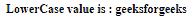
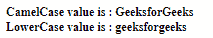

# Angular 10 `lowercase` 管道

> 原文: [https://www.geeksforgeeks.org/angular10-lowercasepipe/](https://www.geeksforgeeks.org/angular10-lowercasepipe/)

在本文中，我们将看到什么是 Angular 10 中的 `lowercase` 管道以及如何使用它。

`lowercase` 管道用于将所有文本转换为小写。

**语法:**

```ts
{{ value | lowercase }}
```

**模块:** `lowercase` 管道使用的模块是:

*   `CommonModule`

**步骤:**

*   创建要使用的 Angular 应用程序。
*   对于要使用的 `lowercase` 管道，不需要任何导入。
*   在 `app.component.ts` 中，定义采用 `lowercase` 值的变量。
*   在 `app.component.html`，使用上面的带有“|”符号的语法来创建 `lowercase` 管道元素。
*   使用 `ng serve` 为 Angular 应用服务，以查看输出。

**输入值:**

*   `value`: 取一个字符串值。

**例 1:**

## `app.component.ts`

```ts
import { Component, OnInit } 
        from '@angular/core';

@Component({
    selector: 'app-root',
    templateUrl: './app.component.html'
})
export class AppComponent {
    // Key Value object
    value : string = 'GEEKSFORGEEKS';
  }
```

## `app.component.html`

```ts
<b>
  <div>
    LowerCase value is :
    {{value |lowercase}}
  </div>
</b>
```

**输出:**



**例 2:**

## `app.component.ts`

```ts
import { Component, OnInit } 
        from '@angular/core';

@Component({
    selector: 'app-root',
    templateUrl: './app.component.html'
})
export class AppComponent {
    // Key Value object
    value : string = 'GeeksforGeeks';
  }
```

## `app.component.html`

```ts
<b>
  <div>
    CamelCase value is :
    {{value}}
  </div>
  <div>
    LowerCase value is : 
    {{value |lowercase}}
  </div>
</b>
```

**输出:**



**参考:** [https://angular.io/api/common/LowerCasePipe](https://angular.io/api/common/LowerCasePipe)