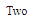

# 角度 10 开关指令

> 原文: [https://www.geeksforgeeks.org/angular10-ngswitch-directive/](https://www.geeksforgeeks.org/angular10-ngswitch-directive/)

在本文中，我们将了解 Angular 10 中的 `NgSwitch` 是什么以及如何使用它。

Angular 10 中的 `NgSwitch` 用于指定显示或隐藏子元素的条件。

**语法:**

```ts
<li *NgSwitch='condition'></li>
```

**模块:** `NgSwitch` 使用的模块是:
* `CommonModule`

**选择器:**
* `[ngSwitch]`

**指令:**
* `NgSwitchCase`

**步骤:**
* 创建要使用的 Angular 应用程序
* 使用 `NgSwitch` 不需要任何导入
* 在 `app.component.ts` 中定义一个变量
* 在 `app.component.html` 中，在需要检查条件的元素中使用带有 `NgSwitchCase` 指令的 `NgSwitch`
* 使用 `ng serve` 为 Angular 应用服务，以查看输出

**示例:**

## app.component.ts

```ts
import { Component, Inject } from '@angular/core';
import { PLATFORM_ID } from '@angular/core';
import { isPlatformWorkerApp } from '@angular/common';

@Component({
  selector: 'app-root',
  templateUrl: './app.component.html',
  styleUrls: [ './app.component.css' ]
})
export class AppComponent {
  num = 2;
}
```

## app.component.html

```ts
<div [ngSwitch]="num">
  <div *ngSwitchCase="'1'">One</div>
  <div *ngSwitchCase="'2'">Two</div>
  <div *ngSwitchCase="'3'">Three</div>
  <div *ngSwitchCase="'4'">Four</div>
  <div *ngSwitchCase="'5'">Five</div>
</div>
```

**输出:**



**参考:** [https://angular.io/api/common/NgSwitch](https://angular.io/api/common/NgSwitch)