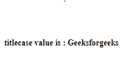
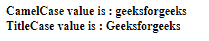

# Angular 10 TitleCasePipe

> 原文: [https://www.geeksforgeeks.org/angular10-titlecasepipe/](https://www.geeksforgeeks.org/angular10-titlecasepipe/)

在本文中，我们将看到什么是 Angular 10 中的 `TitleCasePipe` 以及如何使用它。

`TitleCasePipe` 用于将所有文本转换为 titlecase。

### 语法

```ts
{{ value | TitleCasePipe }}
```

### 模块

`TitleCasePipe` 使用的模块是 `CommonModule`。

### 步骤

1.  创建要使用的 Angular 应用程序。
2.  不需要为使用 `TitleCasePipe` 进行任何导入。
3.  在 `app.component.ts` 中，定义接受 `TitleCasePipe` 值的变量。
4.  在 `app.component.html` 中，使用上面带有“`|`”符号的语法来创建 `TitleCasePipe` 元素。
5.  使用 `ng serve` 为 Angular 应用服务，以查看输出。

### 输入值

*   **值**: 取一个字符串值。

### 示例 1

#### app.component.ts

```ts
import { Component, OnInit } from '@angular/core';

@Component({
    selector: 'app-root',
    templateUrl: './app.component.html'
})
export class AppComponent {
    // Key Value object
    value : string = 'geeksforgeeks';
  }
```

#### app.component.html

```ts
<b>
  <div>
    titlecase value is : {{value | titlecase}}
  </div>
</b>
```

#### 输出



### 示例 2

#### app.component.ts

```ts
import { Component, OnInit } from '@angular/core';

@Component({
    selector: 'app-root',
    templateUrl: './app.component.html'
})
export class AppComponent {
    // Key Value object
    value : string = 'geeksforgeeks';
  }
```

#### app.component.html

```ts
<b>
  <div>
    CamelCase value is : {{value}}
  </div>
  <div>
    TitleCase value is : {{value |titlecase}}
  </div>
</b>
```

#### 输出



### 参考

[https://angular.io/api/common/TitleCasePipe](https://angular.io/api/common/TitleCasePipe)