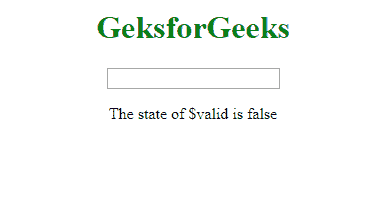
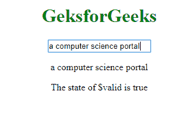
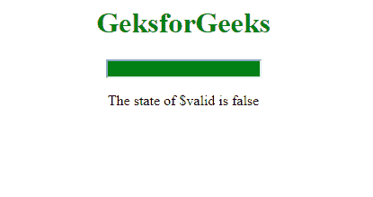
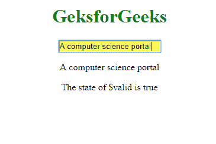

# AngularJS 输入指令

> 原文: [https://www.geeksforgeeks.org/angularjs-input-directive/](https://www.geeksforgeeks.org/angularjs-input-directive/)

`Input` 是一个 HTML 标签，用于获取用户输入，`ng-model` 是一个 AngularJS 指令，用于数据绑定（即输入元素的引用由 `ng-model` 提供）。这两者结合起来修改输入字段。

## 语法

```ts
<input ng-model="name">
```

以下状态被建立到输入字段，其值对于以下情况为真。

*   `$untouched`: 未触及字段时
*   `$touched`: 场被触摸时
*   `$pristine`: 当字段未被修改时
*   `$dirty`: 字段被修改时
*   `$invalid`: 当字段内容无效时
*   `$valid`: 当字段内容有效时

## 示例

`$valid` 状态在表单中所需输入字段的解释如下。

```ts
<!DOCTYPE html>
<html>
<script src="https://ajax.googleapis.com/ajax/libs/angularjs/1.6.9/angular.min.js"></script>
<body ng-app="">
    <center>
        <h1 style="color:green">GeksforGeeks</h1>
        <form name="form1">
            <input name="var1" ng-model="var1" required>
        </form>
        <p>{{var1}}</p>
        <p>The state of $valid is {{form1.var1.$valid}}</p>
    </center>
</body>
</html>
```

**输出:**

**前:**


**之后:**


## 增加的 CSS 类

对于上述输入指令，增加的 CSS 类很少。它们是:

*   `ng-untouched`: 该字段尚未触及
*   `ng-touched`: 该字段已被触摸
*   `ng-pristine`: 该字段尚未修改
*   `ng-dirty`: 字段已被修改
*   `ng-valid`: 字段内容有效
*   `ng-invalid`: 字段内容无效
*   `ng-valid-key`: 每次验证一个键。示例: `ng-valid-required`
*   `ng-invalid-key`: 每次验证一个键。示例: `ng-invalid-required`

如果值为 `false`，则删除类别。

## 示例

如果输入字段与 `required` 属性一起使用，将建立 `valid`（有输入时设置为真）和 `invalid`（无输入时设置为真）状态。如果该值为 `false`，则移除这些类。

```ts
<!DOCTYPE html>
<html>
<head>
    <title>input Directive</title>
    <style>
        input.ng-invalid {
            background-color: green;
        }
        input.ng-valid {
            background-color: yellow;
        }
    </style>
</head>
<script src="https://ajax.googleapis.com/ajax/libs/angularjs/1.6.9/angular.min.js"></script>
<body ng-app="">
    <center>
        <h1 style="color:green">GeksforGeeks</h1>
        <form name="form1">
            <input name="var1" ng-model="var1" required>
        </form>
        <p>{{var1}}</p>
        <p>The state of $valid is {{form1.var1.$valid}}</p>
    </center>
</body>
</html>
```

**输出:**

**前:**


**后:**
