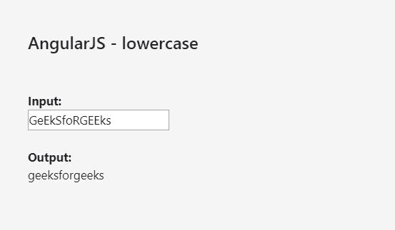
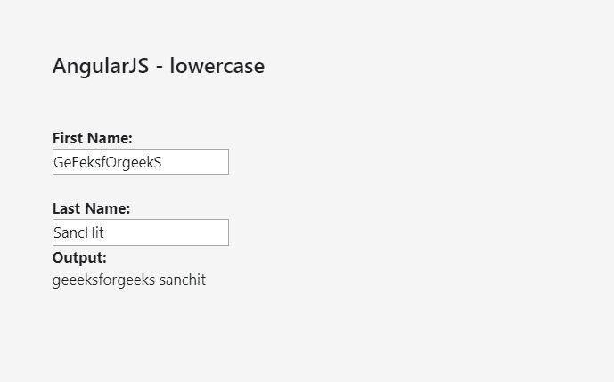

# AngularJS | 小写过滤器

> 原文: [https://www.geeksforgeeks.org/angularjs-lowercase-filter/](https://www.geeksforgeeks.org/angularjs-lowercase-filter/)

**小写过滤器**用于将字符串转换为小写字母。

## 语法

```ts
{{expression|lowercase}}
```

## 示例-1

```ts
<!DOCTYPE html>
<html>
<script src="https://ajax.googleapis.com/ajax/libs/angularjs/1.6.9/angular.min.js"></script>
<body>
<h2>AngularJS - lowercase</h2>
<div ng-app="myApp" ng-controller="myCtrl">
<strong>Input:</strong>
<input type="text" ng-model="string">
<strong>Output:</strong>
{{string|lowercase}}
</div>
<script>
var app = angular.module('myApp', []);
app.controller('myCtrl', function($scope) {
$scope.string = "";
});
</script>
</body>
</html>
```



## 示例-2

```ts
<!DOCTYPE html>
<html>
<script src="https://ajax.googleapis.com/ajax/libs/angularjs/1.6.9/angular.min.js"></script>
<body>
<h2>AngularJS - lowercase</h2>
<div ng-app="myApp" ng-controller="myCtrl">
<strong>First Name:</strong>
<input type="text" ng-model="firstName">
<strong>Last Name:</strong>
<input type="text" ng-model="lastName">
<strong>Output:</strong>
{{firstName|lowercase}} {{lastName|lowercase}}
</div>
<script>
var app = angular.module('myApp', []);
app.controller('myCtrl', function($scope) {
$scope.firstName = "";
$scope.lastName = "";
});
</script>
</body>
</html>
```

## 输出

