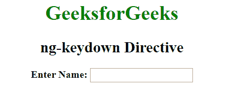
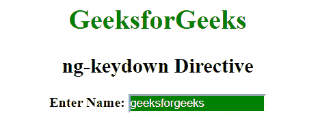

# AngularJS | ng-keydown 指令

> 原文: [https://www.geeksforgeeks.org/angularjs-ng-keydown-directive/](https://www.geeksforgeeks.org/angularjs-ng-keydown-directive/)

AngularJS 中的 `ng-keydown` 指令用于对按键事件应用自定义行为。支持 `<input>`、`<select>` 和 `<textarea>` 元素。

## 语法

```ts
<element ng-keydown="expression"> Contents... </element>
```

## 示例

本示例使用 `ng-keydown` 指令在按下按钮后更改背景颜色。

```ts
<!DOCTYPE html>
<html>

<head>
    <title>ng-keydown Directive</title>

<script src=
"https://ajax.googleapis.com/ajax/libs/angularjs/1.6.9/angular.min.js">
    </script>

<style type="text/css">
        .keyDown {
            background-color: green;
            color: white;
        }
        .keyUp {
            background-color: white;
        }
    </style>
</head>

<body ng-app style="text-align:center">

<h1 style="color:green">
        GeeksforGeeks
    </h1>

<h2>ng-keydown Directive</h2>

<div>
        <b>Enter Name: </b><input type="text"
        ng-model="searchValue" ng-keydown="keyDown=true"
        ng-keyup="keyDown=false" ng-class=
        "{true:'keyDown', false:'keyUp'}[keyDown]" />

<br>
    </div>
</body>

</html>
```

## 输出

**按下按钮前:**


**按下按钮后:**
