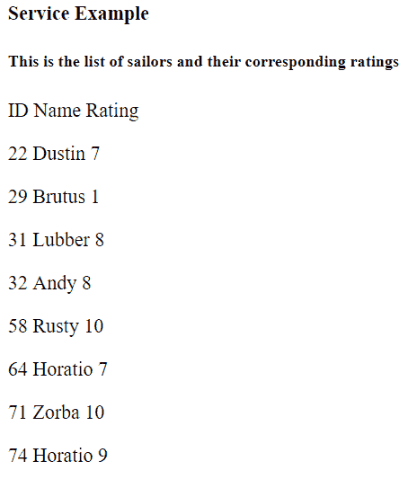

# AngularJS 服务

> 原文：[https://www.geeksforgeeks.org/angularjs-services/](https://www.geeksforgeeks.org/angularjs-services/)

[服务](https://docs.angularjs.org/guide/services) 用于创建可以共享并在其定义组件之外使用的变量/数据。

## 步骤#1：创建服务

```ts
ng g s service-name
```

`s` 是 `service` 的缩写。这将创建两个文件：`service-name.service.spec.ts`（不应更改）和 `service-name.service.ts`。

## 步骤#2：在模块中提供服务

服务创建后，必须将其包含在 `app.module.ts` 的 `providers` 中。

在这里，服务名的第一个字母应大写，后面紧跟无空格的服务名。

## 步骤#3：在服务中创建可共享数据

所以我们现在必须在服务中进行更改，创建一个 JSON 变量，该变量应对各种组件可用。

## 步骤#4：在组件中注入并使用服务

在 `app.component.ts` 中进行以下更改：

```ts
import { ServiceNameService } from './service-name.service';
```

就像我们在 `providers` 中做的那样。

**type: newData**

```ts
constructor(private demoService: ServiceNameService) {}
```

```ts
ngOnInit(): void {
  this.newData = this.demoService.Sailors;
}
```

## 步骤#5：在模板中显示数据

在 `app.component.html` 中，我们将打印存储在 `newData` 中的数据：

```ts
{{newData}}
```

**注意：** 由于我们已经在 `app.component.html` 中添加了 `ngFor`，我们将不得不在 `app.module.ts` 中导入 `FormsModule`。

## 语法（示例#1）

### `service.service.ts`

```ts
import { Injectable } from '@angular/core';

@Injectable({
  providedIn: 'root'
})
export class ServiceService {

  Sailors = [
    {
      id: 22, name: 'Dustin', rating: 7
    },
    {
      id: 29, name: 'Brutus', rating: 1
    },
    {
      id: 31, name: 'Lubber', rating: 8
    },
    {
      id: 32, name: 'Andy', rating: 8
    },
    {
      id: 58, name: 'Rusty', rating: 10
    },
    {
      id: 64, name: 'Horatio', rating: 7
    },
    {
      id: 71, name: 'Zorba', rating: 10
    },
    {
      id: 74, name: 'Horatio', rating: 9
    }
  ];

  constructor() { }

  getData() {
    return 'This is the list of sailors and their corresponding ratings';
  }
}
```

### `app.component.ts`

```ts
import { Component } from '@angular/core';
import { ServiceService } from './service.service';

@Component({
  selector: 'app-root',
  templateUrl: './app.component.html',
  styleUrls: ['./app.component.css']
})
export class AppComponent {
  newData;
  message: string = '';

  constructor(private demoService: ServiceService) {}

  ngOnInit(): void {
    this.newData = this.demoService.Sailors;
    this.message = this.demoService.getData();
  }
}
```

### `app.component.html`

```ts
<b>Service Example</b>
<h5>{{ message }}</h5>
<p> ID Name Rating</p>
<div *ngFor="let m of newData;">
  <p>{{m.id}} {{m.name}} {{m.rating}}</p>
</div>
```

**输出：**


**参考文献：**
[https://coursetro.com/posts/code/61/Angular-4-Services-Tutorial](https://coursetro.com/posts/code/61/Angular-4-Services-Tutorial)