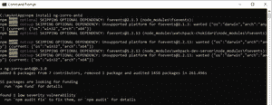
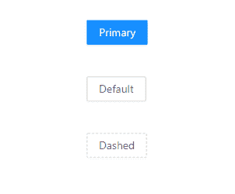

# 蚂蚁设计介绍及安装

> 原文：[https://www.geeksforgeeks.org/ant-design-introduction-and-installation-for-angular/](https://www.geeksforgeeks.org/ant-design-introduction-and-installation-for-angular/)

**Ant Design** 是企业级产品的设计模式，可以与其他前端框架如 **Angular、React 或 Vue** 集成。Ant Design 官方实现与 React 一起发布，但也可以与其他 JavaScript 框架一起使用。它是一个开源工具，拥有大约 50.4 千颗 GitHub 星，是世界上第二大使用最多的 React UI 库。很多公司都在使用这种设计模式，比如**阿里巴巴、腾讯、滴滴等**。

## 蚂蚁设计特点

*   支持国际化。
*   丰富的交互式用户界面。
*   强大的主题定制。
*   存在高质量的组件。
*   高性能。

## 先决条件

*   像 VSCode，Sublime，Brackets 等代码编辑器。
*   系统中应安装 Node.js。

> **适用于 Windows**
>
> [https://www.geeksforgeeks.org/installation-of-node-js-on-windows/](https://www.geeksforgeks.org/installation-of-node-js-on-windows/)
>
> **对于 Linux**
>
> [https://www.geeksforgeks.org/installation-of-node-js-on-linux/](https://www.geeksforgeks.org/installation-of-node-js-on-linux/)

*   具备搭建 Angular 项目的基础知识。

> [https://www.geeksforgeks.org/angular-7-installation/](https://www.geeksforgeks.org/angular-7-installation/)

## 安装蚂蚁设计 for Angular

1.  在终端中，转到您创建的 Angular 项目的文件夹，然后使用以下命令安装 Angular 的蚂蚁设计：

    ```bash
    npm install ng-zorro-antd
    ```

    

2.  在 `angular.json` 文件中添加蚂蚁设计 `ng-zorro-antd.min.css` 文件到 `styles` 数组中，如下所示：

    ```json
    {
      "$schema": "./node_modules/@angular/cli/lib/config/schema.json",
      "version": 1,
      "newProjectRoot": "projects",
      "projects": {
        "myAntApp": {
          "projectType": "application",
          "schematics": {
            "@schematics/angular:component": {
              "style": "scss"
            }
          },
          "root": "",
          "sourceRoot": "src",
          "prefix": "app",
          "architect": {
            "build": {
              "builder": "@angular-devkit/build-angular:browser",
              "options": {
                "outputPath": "dist/myAntApp",
                "index": "src/index.html",
                "main": "src/main.ts",
                "polyfills": "src/polyfills.ts",
                "tsConfig": "tsconfig.app.json",
                "aot": true,
                "assets": [
                  "src/favicon.ico",
                  "src/assets"
                ],
                "styles": [
                  "node_modules/ng-zorro-antd/src/ng-zorro-antd.min.css",
                  "src/styles.scss"
                ],
                "scripts": []
              },
              "configurations": {
                "production": {
                  "fileReplacements": [
                    {
                      "replace": "src/environments/environment.ts",
                      "with": "src/environments/environment.prod.ts"
                    }
                  ],
                  "optimization": true,
                  "outputHashing": "all",
                  "sourceMap": false,
                  "extractCss": true,
                  "namedChunks": false,
                  "extractLicenses": true,
                  "vendorChunk": false,
                  "buildOptimizer": true,
                  "budgets": [
                    {
                      "type": "initial",
                      "maximumWarning": "2mb",
                      "maximumError": "5mb"
                    },
                    {
                      "type": "anyComponentStyle",
                      "maximumWarning": "6kb",
                      "maximumError": "10kb"
                    }
                  ]
                }
              }
            },
            "serve": {
              "builder": "@angular-devkit/build-angular:dev-server",
              "options": {
                "browserTarget": "myAntApp:build"
              },
              "configurations": {
                "production": {
                  "browserTarget": "myAntApp:build:production"
                }
              }
            },
            "extract-i18n": {
              "builder": "@angular-devkit/build-angular:extract-i18n",
              "options": {
                "browserTarget": "myAntApp:build"
              }
            },
            "test": {
              "builder": "@angular-devkit/build-angular:karma",
              "options": {
                "main": "src/test.ts",
                "polyfills": "src/polyfills.ts",
                "tsConfig": "tsconfig.spec.json",
                "karmaConfig": "karma.conf.js",
                "assets": [
                  "src/favicon.ico",
                  "src/assets"
                ],
                "styles": [
                  "src/styles.scss"
                ],
                "scripts": []
              }
            },
            "lint": {
              "builder": "@angular-devkit/build-angular:tslint",
              "options": {
                "tsConfig": [
                  "tsconfig.app.json",
                  "tsconfig.spec.json",
                  "e2e/tsconfig.json"
                ],
                "exclude": [
                  "**/node_modules/**"
                ]
              }
            },
            "e2e": {
              "builder": "@angular-devkit/build-angular:protractor",
              "options": {
                "protractorConfig": "e2e/protractor.conf.js",
                "devServerTarget": "myAntApp:serve"
              },
              "configurations": {
                "production": {
                  "devServerTarget": "myAntApp:serve:production"
                }
              }
            }
          }
        }
      },
      "defaultProject": "myAntApp"
    }
    ```

3.  在 `app.module.ts` 中导入蚂蚁设计按钮模块，这样我们就可以在 `.html` 文件中访问它了，如下所示：

    ```typescript
    import { BrowserModule } from '@angular/platform-browser';
    import { NgModule } from '@angular/core';

    import { AppRoutingModule } from './app-routing.module';
    import { AppComponent } from './app.component';
    import { NzButtonModule } from 'ng-zorro-antd/button';

    @NgModule({
      declarations: [
        AppComponent
      ],
      imports: [
        BrowserModule,
        AppRoutingModule,
        NzButtonModule
      ],
      providers: [],
      bootstrap: [AppComponent]
    })
    export class AppModule { }
    ```

4.  在 `app.component.html` 文件中添加如下代码：

    ```html
    <button nz-button nzType="primary">Primary</button>
    <button nz-button nzType="default">Default</button>
    <button nz-button nzType="dashed">Dashed</button>
    ```

5.  在 `app.component.scss` 中添加一些 CSS 以使按钮居中显示，如下所示：

    ```scss
    [nz-button] {
      margin-left: 50%;
      margin-top: 3%;
    }
    ```

6.  在终端中，使用以下命令在浏览器中运行应用程序：

    ```bash
    ng serve -o
    ```

## 输出



浏览器中的最终输出。