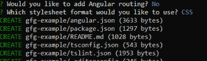
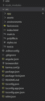
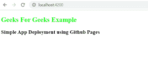
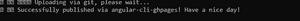
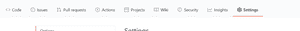
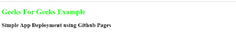

# 使用 GitHub Pages 部署 Angular 应用

> 原文：[https://www.geeksforgeeks.org/deployment-of-angular-application-using-github-pages/](https://www.geeksforgeeks.org/deployment-of-angular-application-using-github-pages/)

部署 Angular 应用的方法有多种，如 GitHub Pages、Heroku、Firebase 等。GitHub 提供了使用 GitHub Pages 的最简单的方式。

## 在 GitHub 页面上创建和部署示例 Angular 应用程序的步骤

### 1. 安装 Node.js
- a. [Windows](https://www.geeksforgeeks.org/installation-of-node-js-on-linux/)
- b. [Linux](https://www.geeksforgeeks.org/installation-of-node-js-on-linux/)

### 2. 安装 Angular CLI
请参考：[安装 Angular CLI](https://www.geeksforgeeks.org/angular-7-installation/)

### 3. 使用 Angular CLI 创建新项目
请参考：[使用 Angular CLI 创建新项目](https://www.geeksforgeeks.org/angular-cli-angular-project-setup/)

```bash
ng new gfg-example
```

上述命令将询问路由和样式的各种问题，按回车键进入默认值：



### 4. 进入项目目录
创建项目后，使用以下命令转到项目目录：

```bash
cd gfg-example
```

项目的结构如下：



### 5. 修改应用组件
转到 `src/app/app.component.html`，删除所有代码并添加以下代码：

```html
<h2 [ngStyle]="{'color':'#00FF00'}">
  Geeks For Geeks Example 
</h2>

<h3>
  Simple App Deployment using Github Pages
</h3>
```

### 6. 在本地运行 Angular 应用程序
现在使用以下命令在本地运行 Angular 应用程序：

```bash
npm start
```

应用编译成功后，转到浏览器打开 `http://localhost:4200/`。



### 7. 停止应用程序并准备 Git 仓库
接下来，停止 Angular 应用程序。
转到 GitHub，并根据您的偏好使用该名称创建新的仓库。
创建 GitHub 仓库后，转到项目目录并打开命令行。

### 8. 将代码推送到 Git
使用以下命令将代码推送到 Git：

```bash
git init
git add .
git commit -m "Initial Commit"
git remote add origin https://github.com/<username>/<reponame>.git
git push -u origin master
```

现在，转到 GitHub 仓库，您的代码应该已经上传到主分支。

### 9. 安装 angular-cli-ghpages
接下来，使用 npm 安装 `angular-cli-ghpages`：

```bash
npm install -g angular-cli-ghpages
```

### 10. 构建生产环境应用
现在，为生产环境构建应用程序：

```bash
ng build --prod --base-href "https://<username>.github.io/<reponame>/"
```

### 11. 部署到 gh-pages 分支
最后，创建 `gh-pages` 分支，并使用以下命令将构建和捆绑的代码上传到该分支：

```bash
ngh --dir dist/gfg-example
```

请记住，我们从开始使用的项目名称是 `gfg-example`。如果您有不同的项目名称，则使用以下命令代替最后一个命令：

```bash
ngh --dir dist/<project-name>
```



### 12. 访问已部署的应用
现在转到 GitHub 仓库中的“设置”选项卡，在 GitHub Pages 下，您将找到已部署应用程序的链接：



打开网址，您将看到我们的 Angular 应用已成功部署：

