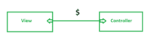
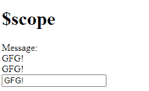
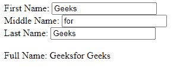
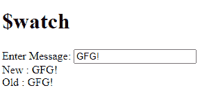
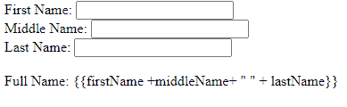

# AngularJS 前缀 `$` 和 `$$` 是如何使用的？

> 原文：[https://www.geeksforgeeks.org/how-angularjs-prefixes-and-are-used/](https://www.geeksforgeeks.org/how-angularjs-prefixes-and-are-used/)

## `$`

AngularJS 中的 `$` 是一个内置对象。它包含应用程序数据和方法。

`$scope` 充当控制器和视图之间的链接。



在控制器函数内部，可以附加 `$scope` 的属性和方法。*表达式*、`ng-model` 或 `ng-bind` 指令可用于显示视图中的 `$scope` 数据。

```ts
<!DOCTYPE html>
<html>
<head>
    <script src="https://ajax.googleapis.com/ajax/libs/angularjs/1.3.16/angular.min.js">
    </script>
</head>
<body ng-app="Ng">
<h1>$scope</h1>
    <div ng-controller="myController">
        Message: <br />
        {{message}}<br />
        <span ng-bind="message"></span> <br />
        <input type="text" ng-model="message" /> 
    </div>
    <script>
        var ngApp = angular.module('Ng', []);
        ngApp.controller('myController', function ($scope) {
            $scope.message = "GFG!";        
        });
    </script>
</body>
</html>
```

**输出：**


**例 2：**

```ts
<!DOCTYPE html>
<html>
    <script src="https://ajax.googleapis.com/ajax/libs/angularjs/1.6.9/angular.min.js">
  </script>
    <body>
        <div ng-app="myApp" ng-controller="myCtrl">
            First Name: <input type="text" 
                               ng-model="firstName" /><br />
            Middle Name: <input type="text" 
                                ng-model="middleName" /><br />
            Last Name: <input type="text" 
                              ng-model="lastName" /><br />
            <br />
         Full Name: {{firstName +middleName+ " " + lastName}}
        </div>
        <script>
            var app = angular.module("myApp", []);
            app.controller("myCtrl", function ($scope) {
                $scope.firstName = "Geeks";
                $scope.middleName = "for";
                $scope.lastName = "Geeks";
            });
        </script>
    </body>
</html>
```

**输出：**


## `$rootScope`

AngularJS 应用程序由一个 `$rootScope` 组成。所有其他 `$scope` 都是子对象。`$rootScope` 附加了属性和方法，所有控制器都可以使用。

| **方法** | **描述** |
| :--- | :--- |
| `$new` | 用于创建一个新的子作用域。 |
| `$watch` | 用于注册一个回调函数，每当模型属性发生变化时就会执行。 |
| `$watchGroup` | 用于注册一个回调函数，每当模型属性发生变化时就会执行这个回调函数。我们在这里指定一组属性。 |
| `$watchCollection` | 用于注册一个回调函数，每当模型对象或数组属性发生变化时就会执行。 |
| `$digest` | 处理当前作用域及其子作用域的所有观察者。 |
| `$destroy` | 从父作用域中移除当前作用域。 |
| `$eval` | 在当前作用域中执行表达式。 |
| `$emit` | 用于将指定事件调度到 `$rootScope`。 |
| `$broadcast` | 将指定事件向下分发到子作用域。 |

**例 3：**

```ts
<!DOCTYPE html>
<html>
<head>
    <script src="https://ajax.googleapis.com/ajax/libs/angularjs/1.3.16/angular.min.js">
   </script>
</head>
<body ng-app="Ng">
<h1> $watch </h1>
    <div ng-controller="Controller">
        Enter Message: <input type="text" ng-model="message" /> <br />
        New : {{newMessage}} <br />
        Old : {{oldMessage}} 
    </div>
    <script>
        var ngApp = angular.module('Ng', []);
        ngApp.controller('Controller', function ($scope) {
            $scope.message = "GFG!";
            $scope.$watch('message', function (newValue, oldValue) {
                $scope.newMessage = newValue;
                $scope.oldMessage = oldValue;
            });
        });
    </script>
</body>
</html>
```

**输出：**


## `$$`

其中的 `$$` 被视为私有变量。我们使用 `$$` 来避免内部变量冲突，并且不对外公开。

其中一些列举如下：`$observers`，`$watchers`，`$childHead`，`$childTail`，`$ChildScope` 等。

| **方法** | **描述** |
| :--- | :--- |
| `$observers` | 包含与作用域关联的所有观察者。 |
| `$asyncQueue` | 它是一个异步任务队列。它在每次 `$digest` 循环中被消费。 |
| `$postDigest(fn)` | 它在下一个 `$digest` 循环周期之后执行 `fn`。 |
| `$destroy` | 销毁其作用域。 |

**语法：**

```ts
$('.selector');
```

或者

```ts
element.all(by.css('.selector'));
```

在核心 AngularJS 功能的帮助下，应用程序模块之间的一种常见通信方式是使用 `$parent`、`$childHead`、`$nextSibling` 在控制器之间建立连接。

**示例：**

```ts
<!DOCTYPE html>
<html>
    <script src="https://ajax.googleapis.com/ajax/libs/angularjs/1.6.9/angular.min.js">
  </script>
    <body>
        <div ng-app="myApp" ng-controller="myCtrl">
            First Name: <input type="text"
                               ng-model="firstName" /><br />
            Middle Name: <input type="text" 
                                ng-model="middleName" /><br />
            Last Name: <input type="text"
                              ng-model="lastName" /><br />
            <br />
       Full Name: {{firstName +middleName+ " " + lastName}}
        </div>
        <script>
            var app = angular.module("myApp", []);
            app.controller("myCtrl", function ($scope) {
                $scope.firstName = "Geeks";
                $scope.middleName = "for";
                $scope.lastName = "Geeks";
            });
        </script>
    </body>
</html>
```

**输出：**


上面的输出将在我们添加 `$$` 时产生，因为它充当私有对象。

因此，为了防止在编写代码时意外的名称冲突，请在公共对象和私有对象的前面加上角前缀。