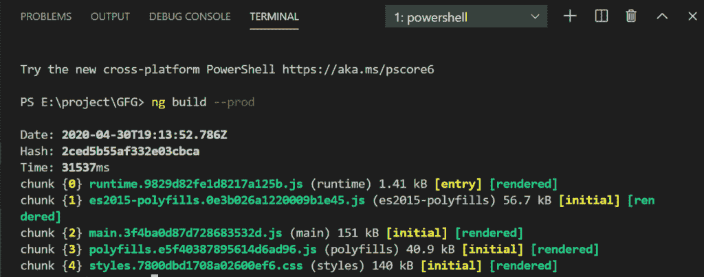
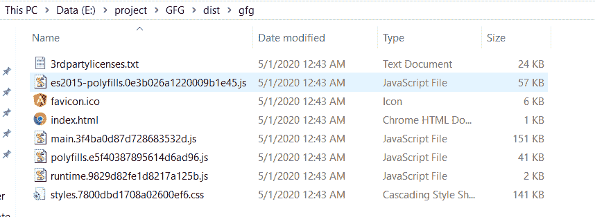

# 如何捆绑 Angular 应用进行生产？

> 原文：[https://www.geeksforgeeks.org/how-to-bundle-an-angular-app-for-production/](https://www.geeksforgeeks.org/how-to-bundle-an-angular-app-for-production/)

## 简介
在部署 web 应用程序之前，Angular 提供了一种借助几个 CLI 命令检查 web 应用程序行为的方法。通常，`ng serve` 命令用于从本地内存构建、监视和服务应用程序。但是对于部署，通过运行 `ng build` 命令可以看到应用程序的行为。

## ng serve 和 ng build 的区别

| ng serve | ng build |
| --- | --- |
| `ng serve` 命令专门用于快速、本地和迭代开发，也用于从本地 CLI 开发服务器构建、监视和服务应用程序。 | `ng build` 命令旨在构建应用程序和部署构建工件。 |
| 该命令不会生成输出文件夹。 | 输出文件夹是 `dist/`。 |
| `ng serve` 从内存中构建工件，以获得更快的开发体验。 | `ng build` 命令只生成一次输出文件，并不提供它们。 |

## 步骤
在执行部署应用程序的步骤之前，请确保系统中已经安装了 **Angular CLI**。如果没有，请运行以下命令。

```ts
npm install -g @angular/cli
```

第一步是在应用程序部署之前将其打包用于生产。

### 导航到项目目录

```ts
cd project-folder
```

### 运行 `ng build` 命令

在 Angular CLI 中运行 `ng build` 命令。

```ts
ng build --prod
```



### 预览应用程序

要预览应用程序，请运行以下命令：

```ts
ng serve --prod
```

这将启动一个带有生产文件的本地 HTTP 服务器。导航到 `http://localhost:4200/` 查看应用程序。
有了这些步骤，应用程序就可以部署了。

## 详解
`ng build` 命令将 Angular app 编译到给定输出路径下名为 `dist/` 的输出目录中。该命令必须在工作目录中执行。Angular 中的应用程序构建器使用 webpack 构建工具，在工作区配置文件 (`angular.json`) 中指定配置选项，或者使用命名的替代配置。当您使用 CLI 创建项目时，默认情况下会创建一个“生产”配置，您可以通过指定 `--configuration="production"` 或 `--prod="true"` 选项来使用该配置。

`--prod` 标志激活许多优化标志。其中之一就是 `--aot`（面向提前编译）。您的组件模板是在构建过程中编译的，因此 TypeScript 可以检测到代码中的更多问题。您可以在开发模式下编译，但是如果您想在为 prod 构建之前看到这个错误，仍然可以激活 `--aot` 标志。

## dist/ 文件夹
`dist` 文件夹是构建文件夹，包含所有可以托管在服务器上的文件和文件夹。
`dist` 文件夹包含 JavaScript 格式的 angular 应用程序的编译代码，以及所需的 HTML 和 CSS 文件。

### 内部文件/文件夹

| 文件夹/文件 | 描述 |
| --- | --- |
| `assets` | 该文件夹包含从 Angular CLI 资产配置中复制的资源。 |
| `index.html` | `index.html` 文件是申请的入口点。 |
| `main.[hash].js` | 该文件包含捆绑应用程序。 |
| `polyfills.[hash].bundle.js` | 它包含多堆依赖项 |
| `runtime-[esversion].[hash].bundle.js` | 它包含网络包加载器 |
| `styles.[hash].bundle.css` | 它包含样式定义 |



## 不足之处

*   **性能:** 动态应用程序的性能并不总是那么好。复杂的 SPA 由于其尺寸，使用起来可能比较缓慢和不方便。
*   **陡峭的学习曲线:** 由于 AngularJS 是一种多用途的仪器，完成任何任务的方法总是不止一种。这在工程师中造成了一些混乱。