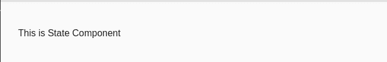

# 如何在 Angular 中强制重定向到特定路由？

> 原文：[https://www.geeksforgeeks.org/how-to-force-redirect-to-a-particular-route-in-angular/](https://www.geeksforgeeks.org/how-to-force-redirect-to-a-particular-route-in-angular/)

## 简介

我们可以使用属性绑定概念，并且可以将查询参数传递给 `routerLink`。使用属性绑定，我们可以绑定 `queryParams` 属性，并可以在对象中提供所需的详细信息。

**属性绑定：** 这是一个概念，我们使用方括号符号将数据绑定到 HTML 元素的 DOM 属性。

```ts
import {Component, OnInit} from '@angular/core'

@Component({
  selector:'app-property',
  template: `<p [textContent]="title"></p>`
})
export class AppComponent implements OnInit{
  constructor(){}
  ngOnInit() {}
  title='Property Binding example in GeeksforGeeks';
}
```

**输出：**


我们可以通过两种方式实现路由重定向：
1.  第一种方法是从 `.html` 文件。
2.  第二种方法是从 `.ts` 文件。

**语法（在 `.html` 文件中）：**

```ts
<a [routerLink]="[/path]" >
   State Details 
</a>
```

## 方法一：从 HTML 文件实现

**思路：**

*   首先，在 `app.module.ts` 中配置路由。
*   用 HTML 文件中所需的路径实现 `routerLink` 属性绑定。
*   提到上面的说明后，我们就可以点击配置好的 HTML 元素，并可以对其进行重定向。
*   一旦你完成点击它，它会自动将你重定向到另一个组件。

**代码实现：**

**`app.module.ts`：**

```ts
import { NgModule } from "@angular/core";
import { BrowserModule } from "@angular/platform-browser";
import { RouterModule, Routes } from "@angular/router";
import { AppComponent } from "./app.component";
import { StateComponent } from "./state/state.component";

const routes: Routes = 
  [{ path: "punjab", component: StateComponent }];

@NgModule({
    imports: [BrowserModule, RouterModule.forRoot(routes)],
    declarations: [AppComponent, StateComponent],
    bootstrap: [AppComponent],
})
export class AppModule {}
```

**`app.component.html`：**

```ts
<a [routerLink]="['/punjab']">
   State Details 
</a>
<router-outlet></router-outlet>
```

点击锚点标签后，我们可以看到 URL 将以如下方式更改，我们将被定向到 `app.module.ts` 文件中已配置的组件。


**输出：**

**`state.component.html`：**



## 方法二：从 TypeScript 文件实现

**思路：**

*   首先，在 `app.module.ts` 中配置路由。
*   通过从 `@angular/router` 导入 `Router` 来实现路由。
*   然后在构造函数中初始化路由器。
*   完成上述过程后，在一个函数中实现路由，以便可以从 `.html` 文件触发该函数。
*   一旦一切都完成了，我们就可以强制将路由重定向到另一个组件。

**代码实现：**

**`app.module.ts`：**

```ts
import { NgModule } from '@angular/core';
import { BrowserModule } from '@angular/platform-browser';
import { RouterModule, Routes } from '@angular/router';
import { AppComponent } from './app.component';
import { StateComponent } from './state/state.component';

const routes: Routes = [
  { path: 'punjab', component: StateComponent },
];

@NgModule({
  imports:      [ BrowserModule, RouterModule.forRoot(routes) ],
  declarations: [ AppComponent, StateComponent ],
  bootstrap:    [ AppComponent ]
})
export class AppModule { }
```

**`app.component.ts`：**

```ts
import { Component, OnInit } from '@angular/core';
import {Router} from '@angular/router';

@Component({
  selector: 'app-main',
  templateUrl: './main.component.html',
  styleUrls: ['./main.component.css']
})
export class HomeComponent implements OnInit {
  constructor(private router:Router) { }
  ngOnInit(){}
  onSelect(){
      this.router.navigate(['/punjab']);
  }
}
```

**`app.component.html`：**

```ts
<a (click)="onSelect()">
   State Details 
</a>
<router-outlet></router-outlet>
```

按照上面的代码和说明，如果你点击锚标签，然后 URL 将被改变，你将被重定向到相应的配置组件。


**输出：**

