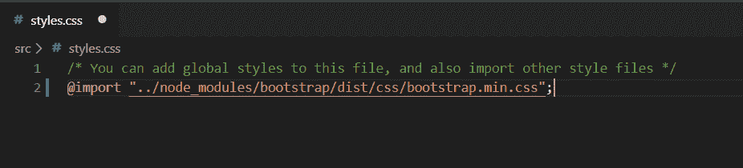
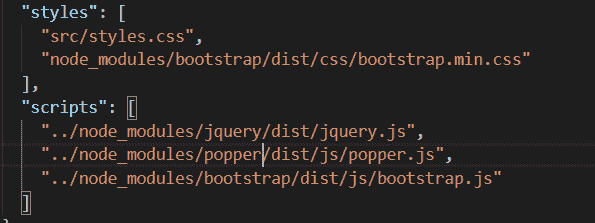
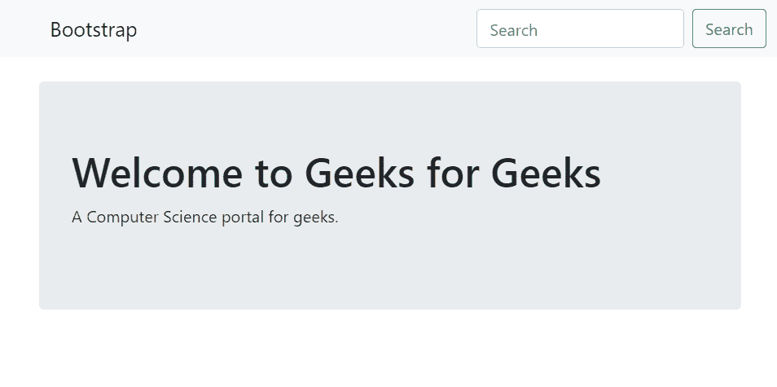

# 如何在 Angular 2 中使用 Bootstrap 4？

> 原文：[https://www.geeksforgeeks.org/how-to-use-bootstrap-4-in-angular-2/](https://www.geeksforgeeks.org/how-to-use-bootstrap-4-in-angular-2/)

**[Bootstrap](https://www.geeksforgeeks.org/bootstrap-tutorials/)** 是一个开源工具包，用于使用 HTML、CSS 和 JS 进行开发。Bootstrap 框架可以和现代的 JavaScript web & 移动框架一起使用，比如 **[Angular](https://www.geeksforgeeks.org/angularjs-tutorials/)**。

**[Bootstrap 4](https://www.geeksforgeeks.org/bootstrap-4-introduction/)** 是 Bootstrap 的最新版本，是目前最流行的 HTML、CSS 和 JavaScript 框架。这篇文章是一步一步指导使用 Bootstrap 4 与 Angular 2。

## 按照以下步骤在 Angular 2 中使用 Bootstrap 4

在执行这些步骤之前，您必须确保已经安装了 **Angular CLI**，如果尚未安装，则运行以下命令安装 Angular CLI。安装完 Angular CLI 后，您可以执行以下步骤。

```bash
npm install -g @angular/cli
```

### 步骤 1
通过在终端运行下面的命令创建一个新项目。

```bash
ng new project-name
```

### 步骤 2
这里需要安装 Bootstrap。现在在终端中打开项目，并在 Angular 2 CLI 上运行以下命令，将 Bootstrap 添加到您的项目中。

```bash
npm i bootstrap@next --save
```

### 步骤 3
现在需要导入 CSS，转到 `src/style.css` 并导入 Bootstrap。

```css
@import "../node_modules/bootstrap/dist/css/bootstrap.min.css";
```



### 步骤 4
为了让 Bootstrap JS 组件正常工作，您仍然需要将 `bootstrap.js` 导入到 `angular.json` 或 `angular-cli.json` 的 `scripts` 部分。这应该会自动发生，但最好还是检查一下。

```json
"scripts": ["../node_modules/jquery/dist/jquery.js",
            "../node_modules/tether/dist/js/tether.js",
            "../node_modules/bootstrap/dist/js/bootstrap.js"],
```



### 步骤 5
现在必须重启服务器。

```bash
ng serve
```

### 步骤 6
现在你要运行 `app.component.html` 代码。

```html
<!DOCTYPE html>
<html>
<head>
    <title>
    </title>
</head>
<body>
    <nav class="navbar navbar-light bg-light">
        <a class="navbar-brand" href="#">
            
            Bootstrap
        </a>
        <form class="form-inline">
            <input class="form-control mr-sm-2" type="search"
                   placeholder="Search" aria-label="Search">
            <button class="btn btn-outline-success my-2 my-sm-0"
                    type="submit">
                Search
            </button>
        </form>
    </nav>
    <div class="container">
        <div class="jumbotron">
            <h1>
                <i class="fa fa-camera-retro"></i>
                Welcome to Geeks for Geeks
            </h1>
            <p>A Computer Science portal for geeks.</p>
        </div>
    </div>
</body>
</html>
```

### 输出
