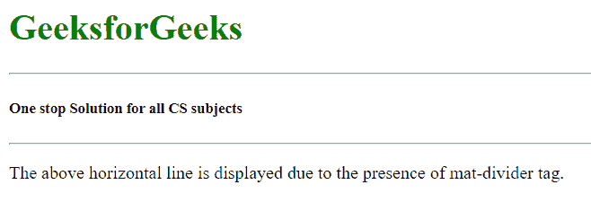

# 如何在 Angular Material 中使用 `<mat-divider>`？

> 原文：[https://www.geeksforgeeks.org/how-to-use-mat-divider-in-angular-material/](https://www.geeksforgeeks.org/how-to-use-mat-divider-in-angular-material/)

Angular Material 是一个 UI 组件库，由 Angular 团队开发，用于构建桌面和移动网络应用程序的设计组件。为了安装它，我们需要在我们的项目中安装 Angular，一旦你有了它，你可以输入下面的命令并下载它。`<mat-divider>` 标签用于用水平线分隔两个部分或内容。

## 安装语法

```
ng add @angular/material
```

## 步骤

1.  首先，使用上述命令安装 Angular Material。
2.  安装完成后，从 `app.module.ts` 文件中的 `@angular/material/divider` 导入 `MatDividerModule`。
3.  导入 `MatDividerModule` 后，我们需要使用 `<mat-divider>` 标签。
4.  当我们使用 `<mat-divider>` 时，屏幕上呈现出一条水平灰线。
5.  这个标记的主要目的是分隔任何两个块、div 或任何部分。
6.  完成上述步骤后，就可以开始项目了。

## 项目结构

如下图。


## 代码实现

### app.module.ts

```typescript
import { NgModule } from '@angular/core';
import { BrowserModule } from '@angular/platform-browser';
import { FormsModule } from '@angular/forms';

import { MatDividerModule } from '@angular/material/divider';
import { AppComponent } from './app.component';
import { BrowserAnimationsModule } from '@angular/platform-browser/animations';

@NgModule({
  imports:
  [
    BrowserModule,
    FormsModule,
    MatDividerModule,
    BrowserAnimationsModule
  ],
  declarations: [ AppComponent ],
  bootstrap: [ AppComponent ]
})
export class AppModule { }
```

### app.component.html

```html
<h1 style="color:green">
    GeeksforGeeks
</h1>

<mat-divider> </mat-divider>

<h5>One stop Solution for all CS subjects</h5>

<mat-divider> </mat-divider>

<p>
    The above horizontal line is displayed
    due to the presence of mat-divider tag.
</p>
```

## 输出

