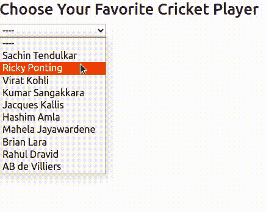

# 如何使用 ngFor 从数组中创建下拉菜单？

> 原文：[https://www.geeksforgeeks.org/how-to-use-ngfor-to-make-a-dropdown-in-angular-from-an-array/](https://www.geeksforgeeks.org/how-to-use-ngfor-to-make-a-dropdown-in-angular-from-an-array/)

在这篇文章中，我们将看到如何使用 Angular 在下拉菜单中显示数组元素。有时我们需要显示动态获取的数据，这正是该特性适用的场景。我们可以迭代数组，应用条件并轻松显示数据。

## 使用 ngFor

`ngFor` 是一个内置的模板指令，它可以很容易地迭代数组或对象之类的东西，并为每个项目创建一个模板。

### 语法

```tshtml
<tag-name *ngFor="let item of array">{{item}}</tag-name>
<tag-name *ngFor="let key of object">{{key}}</tag-name>
```

## 先决条件

必须预装 [NPM](https://www.geeksforgeeks.org/node-js-npm-node-package-manager/)。

## 环境设置

*   安装 Angular CLI：

```tshtml
npm install -g @angular/cli
```

*   创建新的 Angular 项目：

```tshtml
ng new <project-name>
cd <project-name>
```

*   通过运行项目来检查安装。您应该会在 `http://localhost:4200/` 上看到 Angular 着陆页面。

```tshtml
ng serve -o
```

## 创建下拉菜单

1.  创建新组件：

```tshtml
ng g c dropdown
```

2.  它将创建一个包含 4 个新文件的新目录。打开 `dropdown.component.ts`，粘贴如下代码：

**dropdown.component.ts:**

```tshtml
import { Component } from '@angular/core';

@Component({
  selector: 'app-dropdown',
  templateUrl: './dropdown.component.html',
  styleUrls: ['./dropdown.component.css']
})
export class DropdownComponent {
  players = [
    "Sachin Tendulkar",
    "Ricky Ponting",
    "Virat Kohli",
    "Kumar Sangakkara",
    "Jacques Kallis",
    "Hashim Amla",
    "Mahela Jayawardene",
    "Brian Lara",
    "Rahul Dravid",
    "AB de Villiers"
  ]
  selected = "----"

  update(e){
    this.selected = e.target.value
  }
}
```

在上面的代码中，我们已经定义了 `players` 数组，该数组包含我们将在下拉菜单中显示的数据。此外，我们有一个 `selected` 变量，我们将使用它来显示选定的元素。方法 `update()` 获取一个事件，并将 `selected` 设置为其值。

3.  现在将以下代码添加到 `dropdown.component.html` 中：

**dropdown.component.html:**

```tshtml
<h3>Choose Your Favorite Cricket Player</h3>
<select #cricket (change)="update($event)">
    <option value="default">----</option>
    <option *ngFor="let player of players" [value]="player">
        {{player}}
    </option>
</select>

<p>You selected {{selected}}</p>
```

我们已经创建了一个下拉菜单，将使用 `players` 数组。使用 `*ngFor` 填充选项。`selected` 变量用于显示所选选项。

4.  最后将此组件添加到 `app.component.html` 中：

**app.component.html:**

```tshtml
<app-dropdown></app-dropdown>
```

5.  现在运行项目并打开 `http://localhost:4200/` 查看结果：

```tshtml
ng serve -o
```

## 输出

