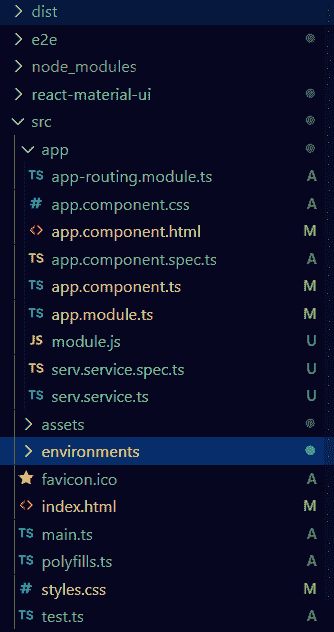
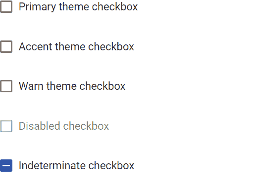

# mat-checkbox 在 Angular Material 中的使用

> 原文: [https://www.geeksforgeeks.org/mat-checkbox-in-angular-material/](https://www.geeksforgeeks.org/mat-checkbox-in-angular-material/)

Angular Material 是一个 UI 组件库，由 Angular 团队开发，用于构建桌面和移动网络应用程序的设计组件。为了安装它，我们需要在我们的项目中安装 Angular，一旦你有了它，你可以输入下面的命令并下载它。`<mat-checkbox>` 用于在我们有多个选项要选择时进行检查或选择。

**安装语法:**

```ts
ng add @angular/material
```

**步骤:**

*   首先，使用上述命令安装 Angular Material。
*   安装完成后，从 `app.module.ts` 文件中的 `@angular/material/checkbox` 导入 `MatCheckboxModule`。
*   然后我们需要使用 `<mat-checkbox>` 标签来显示复选框。
*   我们还可以使用 `disabled` 输入属性来禁用复选框。
*   如果我们想改变主题，那么我们可以使用 `color` 属性来改变它。在 Angular 中，我们有 3 个主题，它们是 `primary`、`accent` 和 `warn`。
*   完成上述步骤后，就可以开始项目了。

**项目结构:** 如下图:



## app.module.ts

```ts
import { NgModule } from '@angular/core';
import { BrowserModule } from '@angular/platform-browser';
import { FormsModule } from '@angular/forms';

import { MatCheckboxModule } from '@angular/material/checkbox';
import { AppComponent } from './app.component';
import { BrowserAnimationsModule } from '@angular/platform-browser/animations';

@NgModule({
  imports:
  [
    BrowserModule,
    FormsModule,
    MatCheckboxModule,
    BrowserAnimationsModule
  ],
  declarations: [ AppComponent ],
  bootstrap: [ AppComponent ]
})

export class AppModule { }
```

## app.component.html

```ts
<mat-checkbox color="primary">
  Primary theme checkbox
</mat-checkbox>

<br>
<br>

<mat-checkbox color="accent">
  Accent theme checkbox
</mat-checkbox>

<br>
<br>

<mat-checkbox color="warn">
  Warn theme checkbox
</mat-checkbox>

<br>
<br>

<mat-checkbox color="warn" disabled>
  Disabled checkbox
</mat-checkbox>

<br>
<br>

<mat-checkbox color="primary" indeterminate="true">
  Indeterminate checkbox
</mat-checkbox>
```

**输出:**

