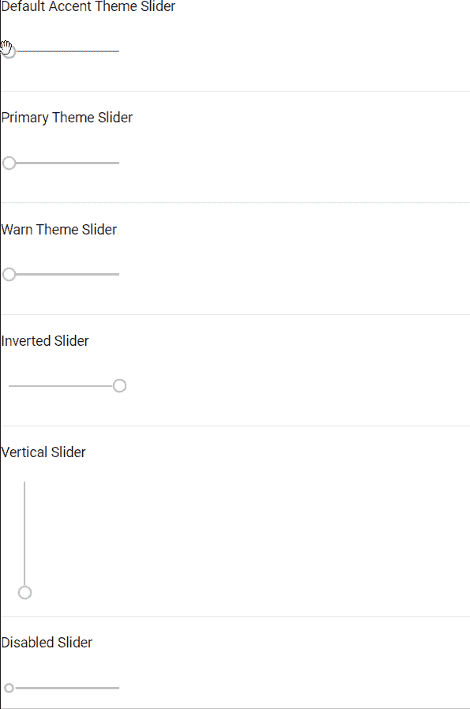

# `<mat-slider>` 在 Angular Material 中

> 原文: [https://www.geeksforgeeks.org/mat-slider-in-angular-material/](https://www.geeksforgeeks.org/mat-slider-in-angular-material/)

Angular Material 是一个 UI 组件库，由 Angular 团队开发，用于构建桌面和移动网络应用程序的设计组件。为了安装它，我们需要在我们的项目中安装 Angular，一旦你有了它，你可以输入下面的命令并下载它。在我们的项目中，只要需要滑块，就会使用 `<mat-slider>` 标签。

## 安装语法

```ts
ng add @angular/material
```

## 进场

*   首先，使用上述命令安装 Angular Material。
*   安装完成后，从 `app.module.ts` 文件中的 `@angular/material/slider` 导入 `MatSliderModule`。
*   然后使用 `<mat-slider>` 标签来显示滑块。
*   `<mat-slider>` 中有很多属性，帮助我们在不同的场景中使用它。
*   下表解释了一些重要的属性。
*   如果我们想改变主题，那么我们可以使用 `color` 属性来改变它。在 Angular 中，我们有 3 个主题，它们是 `primary`、`accent` 和 `warn`。
*   默认情况下，会设置 `accent` 主题。
*   完成上述步骤后，就可以开始项目了。

| 属性名称 | 意义 |
| :--- | :--- |
| `invert` | 以便以相反的方向显示滑块。 |
| `vertical` | 以便在垂直方向上显示滑块。 |
| `disabled` | 为了禁用滑块 |

## 代码实现

### `app.module.ts`

```ts
import { NgModule } from '@angular/core';
import { BrowserModule } from '@angular/platform-browser';
import { FormsModule } from '@angular/forms';

import { AppComponent } from './app.component';
import { MatSliderModule } from '@angular/material/slider';

@NgModule({
  imports:
  [ BrowserModule,
    FormsModule,
    MatSliderModule],
  declarations: [ AppComponent ],
  bootstrap: [ AppComponent ]
})
export class AppModule { }
```

### `app.component.html`

```ts
<p>Default Accent Theme Slider</p>
<mat-slider></mat-slider>
<hr>

<p>Primary Theme Slider</p>
<mat-slider color="primary"></mat-slider>
<hr>

<p>Warn Theme Slider</p>
<mat-slider color="warn"></mat-slider>
<hr>

<p>Inverted Slider</p>
<mat-slider invert="true"></mat-slider>
<hr>

<p>Vertical Slider</p>
<mat-slider vertical="true"></mat-slider>
<hr>

<p>Disabled Slider</p>
<mat-slider disabled="true"></mat-slider>
<hr>
```

## 输出

