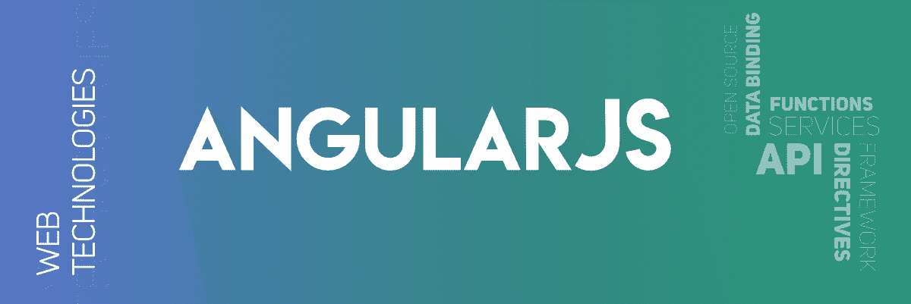

# 什么是 AngularJS 全局 API？

> 原文: [https://www.geeksforgeeks.org/what-are-the-angularjs-global-api/](https://www.geeksforgeeks.org/what-are-the-angularjs-global-api/)



**AngularJS** 中的全局 API
API 代表*应用编程接口*。它是一组用于构建软件应用程序的协议、例程和工具，允许用户与应用程序交互并执行若干任务。

在 AngularJS 中，全局 API 是一组全局 Javascript 函数，用于执行比较对象、迭代对象、转换数据等任务。

## AngularJS 中的 API 函数

AngularJS 中的一些 API 函数如下所示:

### angular.lowercase

`angular.lowercase` 用于将字符串转换为小写。

**语法:**

```ts
angular.lowercase(string);
```

**例 1:**

```ts
<html>
<script src=
"https://ajax.googleapis.com/ajax/libs/angularjs/1.6.9/angular.min.js">
  </script>

<body>
    <div ng-app="App" ng-controller="Ctrl">
        <p>{{"Before Conversion: " + i1 }}</p>
        <p>{{"After Conversion: " + i2 }}</p>
    </div>
    <script>
        var app = angular.module('App', []);
        app.controller('Ctrl', function($scope) {
            $scope.i1 = "GeeksforGeeks";
            // converting string into lowercase
            $scope.i2 = angular.lowercase($scope.i1); 
        });
    </script>
</body>

</html>
```

**输出:**

```ts
Before Conversion: GeeksforGeeks                   
After Conversion: geeksforgeeks
```

### angular.uppercase

`angular.uppercase` 用于将字符串转换为大写。

**语法:**

```ts
angular.uppercase(string);
```

**例 2:**

```ts
<html>
<script src=
"https://ajax.googleapis.com/ajax/libs/angularjs/1.6.9/angular.min.js">
  </script>

<body>
    <div ng-app="App" ng-controller="Ctrl">
        <p>{{"Before Conversion: " + i1 }}</p>
        <p>{{"After Conversion: " + i2 }}</p>
    </div>
    <script>
        var app = angular.module('App', []);
        app.controller('Ctrl', function($scope) {
            $scope.i1 = "geeksforGeeks";
            // converting string into uppercase
            $scope.i2 = angular.uppercase($scope.i1); 
        });
    </script>
</body>

</html>
```

**输出:**

```ts
Before Conversion: geeksforgeeks
After Conversion: GEEKSFORGEEKS
```

### angular.isString

`angular.isString` 用于检查给定值是否为字符串。如果是字符串则返回 `true`，否则返回 `false`。

**语法:**

```ts
angular.isString(value);
```

**例**

```ts
<html>
<script src=
"https://ajax.googleapis.com/ajax/libs/angularjs/1.6.9/angular.min.js">
  </script>

<body>
    <div ng-app="App" ng-controller="Ctrl">
        <p>{{"Value is: " + i1 }}</p>
        <p>{{"Value is string: " + i2 }}</p>
    </div>
    <script>
        var app = angular.module('App', []);
        app.controller('Ctrl', function($scope) {
            $scope.i1 = 15;
            // checks whether the given value is a string
            $scope.i2 = angular.isString($scope.i1); 
        });
    </script>
</body>

</html>
```

**输出:**

```ts
Value is: 15
Value is String: false
```

### angular.isNumber

`angular.isNumber` 用于检查给定值是否为数字。如果是数字则返回 `true`，否则返回 `false`。

**语法:**

```ts
angular.isNumber(value);
```

**例**

```ts
<html>
<script src=
"https://ajax.googleapis.com/ajax/libs/angularjs/1.6.9/angular.min.js">
  </script>

<body>
    <div ng-app="App" ng-controller="Ctrl">
        <p>{{"Value is: " + i1 }}</p>
        <p>{{"Value is string: " + i2 }}</p>
    </div>
    <script>
        var app = angular.module('App', []);
        app.controller('Ctrl', function($scope) {
            $scope.i1 = 15;
            // checks whether the given value is a number
            $scope.i2 = angular.isNumber($scope.i1); 
        });
    </script>
</body>

</html>
```

**输出:**

```ts
Value is: 15
Value is Number: true
```

## 更多的 AngularJS API

**AngularJS** 中更多的 API 如下:

*   `angular.isDate`: 检查给定值是否为日期
*   `angular.isArray`: 检查给定的引用是否是数组
*   `angular.isFunction`: 检查给定的引用是否是函数
*   `angular.isObject`: 检查给定的引用是否是对象