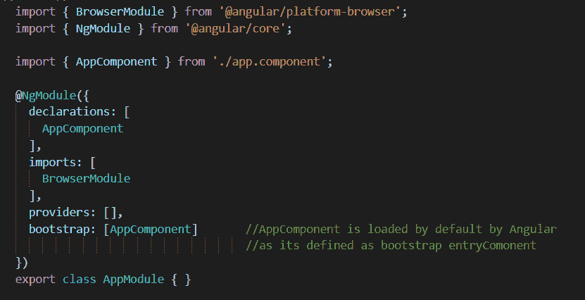
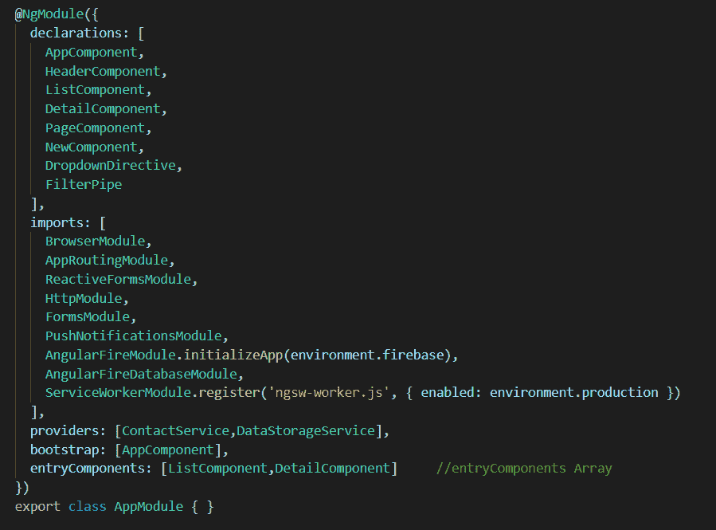

# 什么是Angular模块的entryComponents？

> 原文：[https://www.geeksforgeeks.org/what-is-entrycomponents-in-angular-ngmodule/](https://www.geeksforgeeks.org/what-is-entrycomponents-in-angular-ngmodule/)

`entryComponent` 是通过动态加载方式加载的Angular组件，这意味着这些组件在HTML模板中没有被引用。在大多数情况下，当组件在组件模板中显式声明时，Angular会加载组件。但 `entryComponents` 的情况并非如此。`entryComponents` 只能动态加载，在组件模板中永远不会被引用。它指的是在HTML中找不到的组件数组，而是由 `ComponentFactoryResolver` 添加的。

首先，Angular通过 [`ComponentFactoryResolver`](https://angular.io/api/core/ComponentFactoryResolver) 类为每个引导入口组件创建一个组件工厂，然后在运行时，它将使用这些工厂来实例化组件。

```ts
abstract class ComponentFactoryResolver {
  static NULL: ComponentFactoryResolver
  abstract resolveComponentFactory(component: Type): ComponentFactory
}
```

# Angular中入口组件的类型

1.  引导程序根组件
2.  路由组件（在路由中指定的组件）

## 引导entryComponent

在应用程序启动时或引导过程中，引导组件由Angular加载到DOM（文档对象模型）中。

```ts
import { BrowserModule } from '@angular/platform-browser';
import { NgModule } from '@angular/core';

import { AppComponent } from './app.component';

@NgModule({
  declarations: [
    AppComponent
  ],
  imports: [
    BrowserModule
  ],
  providers: [],
  bootstrap: [AppComponent]
})
export class AppModule { }
```

引导组件是一个 `entryComponent`，它为应用程序提供入口点。默认情况下，Angular加载列在 `@NgModule` 的 `bootstrap` 属性中的 `AppComponent`。



app.module.ts

## Routed entryComponent

这类组件被声明为组件，并作为数组添加到应用程序的 `declarations` 部分。但是，您可能需要通过组件的类来引用它。路由组件没有在组件的HTML中明确指定，而是在 `routes` 数组中注册。这些组件也是动态加载的，因此Angular需要了解它们。

这些组件添加在两个地方：

*   路由器
*   `entryComponents`

### app-routing.module.ts

```ts
import { NgModule } from '@angular/core';
import { RouterModule, Routes } from '@angular/router';
import { ListComponent } from './list/list.component';
import { DetailComponent } from './detail/detail.component';

const routes: Routes = [
  {
     path:'',
     redirectTo:'/contact', 
     pathMatch:'full'
  },
  {
    path: 'list',
    component: ListComponent
  },
  {
    path: 'detail',
    component: DetailComponent
  },
  { 
    path:'**',
    redirectTo:'/not-found'
  }
];
@NgModule({
    imports:[RouterModule.forRoot(routes)],
    exports:[RouterModule]
})
export class AppRoutingModule{

}
```

您不需要将组件显式添加到 `entryComponent` 数组，Angular会自动添加。编译器将所有路由组件添加到 `entryComponent` 数组中。



## 为什么需要entryComponent数组

Angular仅包括模板中引用的组件到最终的打包文件中。这样做是为了通过不包含不需要的组件来减小最终打包的尺寸。但是这会破坏最终的应用程序，因为所有的 `entryComponents` 永远不会包含在最终的包中（因为它们从来没有被引用过）。因此，我们需要在Angular的 `entryComponents` 数组下注册这些组件，以便将它们包含在包中。