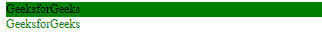

# Angular 10 中的 NgStyle 是什么？

> 原文: [https://www.geeksforgeeks.org/what-is-ngstyle-in-angular-10/](https://www.geeksforgeeks.org/what-is-ngstyle-in-angular-10/)

在这篇文章中，我们将看到什么是 Angular 10 中的 `NgStyle` 以及如何使用它。

`NgStyle` 用于给 HTML 元素添加一些样式。

**语法:**

```ts
<element [ngStyle] = "typescript_property">
```

**步骤:**

*   创建要使用的 Angular 应用程序。
*   在 `app.component.html` 中，创建一个元素并使用 `ngStyle` 指令设置它的样式。
*   使用 `ng serve` 为 Angular 应用提供服务，以查看输出。

**例 1:**

## app.component.ts

```ts
import { Component, OnInit } from '@angular/core';

@Component({
    selector: 'app-root',
    templateUrl: './app.component.html'
})
export class AppComponent {

}
```

## app.component.html

```ts
<div [ngStyle] ="{'background-color':'green'}">
  GeeksforGeeks
</div>

<div [ngStyle] ="{'color':'GREEN'}">
  GeeksforGeeks
</div>
```

**输出:**

