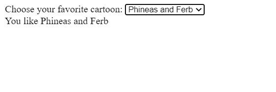
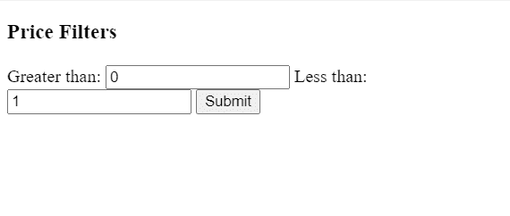

# Angular 中的 `change` 和 `ngModelChange` 有什么区别？

> 原文: [https://www.geeksforgeeks.org/what-is-the-difference-between-change-and-ngmodelchange-in-angular/](https://www.geeksforgeeks.org/what-is-the-difference-between-change-and-ngmodelchange-in-angular/)

## `change`

当用户提交对元素值的变更时，针对`<input>`、`<select>`和`<textarea>`元素触发`change`事件。对于元素值的每次更改，不一定会触发`change`事件。`change`是一个`DOM`事件，它可以触发`HTML`标签和元素的变更。

*   **语法:**

    ```tshtml
    <input (change)="function($e)">
    ```

*   **示例:**

    `HTML` 文件:

    ```tshtml
    <label>Choose your favorite cartoon:
      <select class="cartoon" name="cartoon">
        <option value="">Select One …</option>
        <option value="Tom and Jerry">Tom and Jerry</option>
        <option value="Doraemon">Doraemon</option>
        <option value="Phineas and Ferb">Phineas and Ferb</option>
      </select>
    </label>

    <div class="result"></div>
    ```

    `TypeScript` 文件:

    ```tshtml
    const selectElement = document.querySelector('.cartoon');

    selectElement.addEventListener('change', (event) => {
      const result = document.querySelector('.result');
      result.textContent = `You like ${event.target.value}`;
    });
    ```

*   **输出**

    

## `ngModelChange`

当用户想要更改模型时，通过在输入中输入文本，事件回调将触发并为模型设置新值。我们不能在没有`ngModel`的情况下使用`ngModelChange`，因为`ngModel`类具有带有`EventEmitter`实例的更新函数。只有当模型将更改或更新时，才会触发`ngModelChange`。

*   **语法**

    ```tshtml
    <input [(ngModel)]="value" (ngModelChange)="function($e)">
    ```

*   **示例**

    `HTML` 文件:

    ```tshtml
    <div style="color: red" *ngIf="isInvalid">
              Please check your ranges
    </div>
    <form (submit)="onSubmit()"
          id="inputForm"
          class="form-group"
          class="row">
        <h3>Price Filters</h3>
        <span>Greater than:</span>
        <input type="number" name="greaterThanValue"
             [(ngModel)]="greaterThanValue"
             (ngModelChange)="onChange($event)"
             placeholder="0">
        <span>Less than:</span>
        <input type="number" name="lessThanValue"
             [(ngModel)]="lessThanValue"
             (ngModelChange)="onChange($event)">
        <input type="submit">
    </form>
    ```

    `TypeScript` 文件:

    ```tshtml
    import { Component } from '@angular/core';

    @Component({
      selector: 'my-app',
      templateUrl: './app.component.html',
      styleUrls: [ './app.component.css' ]
    })
    export class AppComponent {
      public greaterThanValue = 0;
      public lessThanValue = 1;
      public isInvalid: boolean = false;

      public onChange(event: any): void {
        this.isInvalid =
          this.greaterThanValue > this.lessThanValue;
      }
    }
    ```

*   **输出**

    

## 差异

| `change` | `ngModelChange` |
| --- | --- |
| `change`事件绑定到`HTML`的`onchange`事件。这是一个`DOM`事件。 | `ngModelChange`绑定到与输入绑定的模型变量。 |
| 不需要特定的类。 | `ngModelChange`需要`ngModel`类才能工作。 |
| `change`事件绑定到传统的输入`change`事件。 | 当模型改变时，`ngModelChange`事件会被触发。没有`ngModel`指令，你无法使用此事件。 |
| 当用户更改输入时，`change`事件触发。 | 当模型改变时，`ngModelChange`会触发，无论改变是否由用户引起。 |