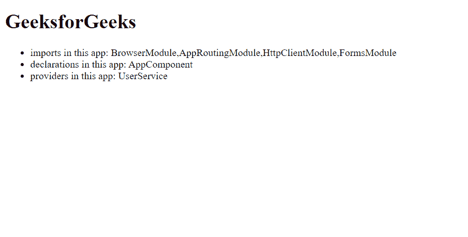

# NgModule 中的声明、提供者和导入有什么区别？

> 原文：[https://www.geeksforgeeks.org/what-is-the-difference-between-declarations-providers-and-import-in-ngmodule/](https://www.geeksforgeeks.org/what-is-the-difference-between-declarations-providers-and-import-in-ngmodule/)

让我们首先讨论一下这些术语：

## 声明

*   声明用于**声明属于**当前模块的**组件、指令、管道。**
*   声明内部的一切都是相互了解的。
*   声明用于使当前模块中的指令（包括组件和管道）对当前模块中的其他指令可用。
*   指令、组件或管道的选择器只有在声明或导入时才与 HTML 匹配。

## 提供者

*   提供者用于使**服务**和值为**依赖注入**所知。
*   它们被添加到根范围，并被注入到具有它们作为**依赖项的其他服务或指令中。**

## 进口

*   导入**使**其他模块的导出申报**在当前模块中可用**。
*   用于**导入支持模块**如 `FormsModule`、`RouterModule`、`CommonModule` 等。

## 差异

| **声明** | **提供者** | **进口** |
| :--- | :--- | :--- |
| `Declarations` 用于给出指令。 | `Providers` 用于提供服务。 | `Import` 使其他模块的导出声明在当前模块中可用。 |
| 用于声明属于当前模块的组件、指令和管道。 | 用于将组件、指令和管道所需的服务注入到我们的模块中。 | 用于导入支持模块，如 `FormsModule` 和 `RouterModule`。 |
| 例如：`AppComponent`。 | 例如：`StatusService`。 | 例如：`BrowserModule`。 |
| 在 `@NgModule` 的 `declarations` 数组中定义。<br>`@NgModule({ declarations: [] })` | 在 `@NgModule` 的 `providers` 数组中定义。<br>`@NgModule({ providers: [] })` | 在 `@NgModule` 的 `imports` 数组中定义。<br>`@NgModule({ imports: [] })` |

## 使用声明、进口和提供者的示例

本项目中使用的提供者是名为 `UserService` 的定制服务。

```bash
ng g s User
```

**user.service.ts**

```typescript
import { Injectable } from '@angular/core';

@Injectable({
  providedIn: 'root'
})
export class UserService {
  constructor() { }
}
```

该 `UserService` 在 `AppModule` 中用作提供商。

**app.module.ts**

```typescript
// imports for the application
import { BrowserModule } from '@angular/platform-browser';
import { NgModule } from '@angular/core';
import { HttpClientModule } from '@angular/common/http';
import { FormsModule } from '@angular/forms';
import { AppRoutingModule } from './app-routing.module';
// declarations for the application
import { AppComponent } from './app.component';
// providers for the application
import { UserService } from './user.service';

@NgModule({
  declarations: [
    AppComponent,
  ],
  imports: [
    BrowserModule,
    AppRoutingModule,
    HttpClientModule,
    FormsModule
  ],
  providers: [UserService],
  bootstrap: [AppComponent]
})
export class AppModule { }
```

**app.component.html**

```html
<h1>GeeksforGeeks</h1>
<ul>
    <li>imports in this app: BrowserModule,
      AppRoutingModule, HttpClientModule, FormsModule</li>
    <li>declarations in this app: AppComponent</li>
    <li>providers in this app: UserService</li>
</ul>
```

**输出：**

