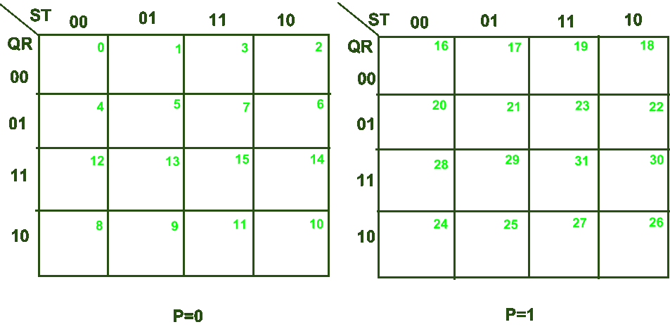
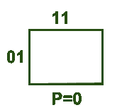
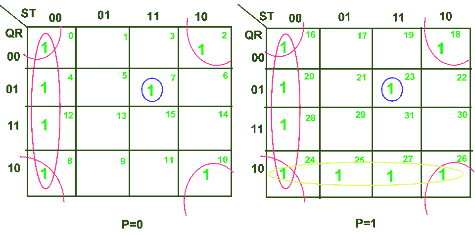
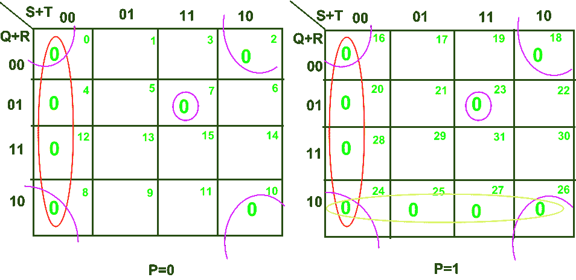

# 数字逻辑中的 5 变量 K 图

> 原文: [https://www.geeksforgeeks.org/5-variable-k-map-in-digital-logic/](https://www.geeksforgeeks.org/5-variable-k-map-in-digital-logic/)

## 先决条件

[K-Map 中的隐含](https://www.geeksforgeeks.org/digital-logic-implicants-k-map/)

## 卡诺图介绍

[卡诺图](https://www.geeksforgeeks.org/k-mapkarnaugh-map/) 或 K-Map 是编写真值表的替代方法，用于布尔表达式的简化。至此我们熟悉了 3 变量 K-Map & 4 变量 K-Map。现在，让我们详细讨论一下 5 变量 K-Map。

任何包含 5 个变量的布尔表达式或函数都可以用 5 变量 K-Map 求解。这样一个 5 变量 K-Map 必须包含 `$2^{5} = 32$` 个单元格。让 5 变量布尔函数表示为 `f(P, Q, R, S, T)`，其中 `P`、`Q`、`R`、`S`、`T` 为变量，`P` 为最高有效位变量，`T` 为最低有效位变量。

标准操作程序表达式的这种 K 图的结构如下所示:

从这里描述的例子可以理解每个单元对应的单元号:

这里对于变量 `P=0`，我们有 `Q = 0`，`R = 1`，`S = 1`，`T = 1`，即 `(P, Q, R, S, T) = (0, 0, 1, 1, 1)`。在十进制形式中，这相当于 `7`。因此，对于上面显示的单元格，对应的单元格编号= `7`。以类似的方式，我们可以写出对应于每个单元格的单元格号，如上图所示。

现在让我们讨论如何使用 5 变量 K-Map 来最小化布尔函数。

### 需遵守的规则

1.  如果一个函数以紧致规范 SOP(乘积和)的形式给出，那么我们在相应的单元号中写下对应于每个小项(问题中提供)的“1”。例如:
    对于 `$\sum m(0, 1, 5, 7, 30, 31)$`，我们将写“1”对应单元号(`0`，`1`，`5`，`7`，`30` 和 `31`)。
2.  如果一个函数是以紧规范 POS(和的乘积)形式给出的，那么我们在相应的单元号中写下“0”对应于每个最大项(问题中提供的)。例如:
    对于 `$\prod M(0, 1, 5, 7, 30, 31)$`，我们将写“0”对应单元号(`0`，`1`，`5`，`7`，`30` 和 `31`)。

### 应遵循的步骤

1.  在标准操作程序的情况下，制作尽可能大的子多维数据集，覆盖所有标记为 `1` 的子多维数据集，或者在位置图的情况下，覆盖所有标记为 `0` 的子多维数据集。需要注意的是，每个子多维数据集只能包含 `2` 的幂项。此外，当且仅当在每个单元格的子多维数据集中，我们满足“m”个单元格是“T1”个相邻单元格“T2”时，`$2^{m}$`个单元格的子多维数据集中也是可能的。
2.  所有*本质素隐含*必须出现在最小表达式中。

## 求解 SOP 函数

为了清楚理解，我们用下面的表达式求解 5 变量 K-Map 的 SOP 函数最小化的例子:
`$\sum m(0, 2, 4, 7, 8, 10, 12, 16, 18, 20, 23, 24, 25, 26, 27, 28)$`

在上面的 K 图中，我们有 4 个子立方体:

*   **子多维数据集 1:** 用红色标记的子多维数据集由单元格(`0`、`4`、`8`、`12`、`16`、`20`、`24`、`28`)组成
*   **子多维数据集 2:** 蓝色标记的子代由细胞(`7`，`23`)组成
*   **子多维数据集 3:** 标记为粉红色的子代由细胞(`0`、`2`、`8`、`10`、`16`、`18`、`24`、`26`)组成
*   **子多维数据集 4:** 黄色标记的子代包括细胞(`24`、`25`、`26`、`27`)

现在，在编写每个子多维数据集中的最小表达式时，我们将搜索该子多维数据集中所有单元格所共有的文字。

*   **子多维数据集 1:** `$\bar S \bar T$`
*   **子多维数据集 2:** `$\bar Q R S T$`
*   **子多维数据集 3:** `$\bar R \bar T$`
*   **子多维数据集 4:** `$P Q \bar R$`

最后给定布尔函数的最小表达式可以表示如下:
`$f(P, Q, R, S, T) = \bar S \bar T + \bar Q R S T + \bar R \bar T + P Q \bar R$`

## 求解 POS 函数

现在，让我们使用以下表达式求解 5 变量 K-Map 的 POS 函数最小化示例:
`$\prod M(0, 2, 4, 7, 8, 10, 12, 16, 18, 20, 23, 24, 25, 26, 27, 28)$`

在上面的 K 图中，我们有 4 个子立方体:

*   **子多维数据集 1:** 用红色标记的子多维数据集由单元格(`0`、`4`、`8`、`12`、`16`、`20`、`24`、`28`)组成
*   **子多维数据集 2:** 蓝色标记的子代由细胞(`7`，`23`)组成
*   **子多维数据集 3:** 标记为粉红色的子代由细胞(`0`、`2`、`8`、`10`、`16`、`18`、`24`、`26`)组成
*   **子多维数据集 4:** 黄色标记的子代包括细胞(`24`、`25`、`26`、`27`)

现在，在编写每个子多维数据集中的最小表达式时，我们将搜索该子多维数据集中所有单元格所共有的文字。

*   **子多维数据集 1:** `$S + T$`
*   **子多维数据集 2:** `$Q + \bar R + \bar S + \bar T$`
*   **子多维数据集 3:** `$R + T$`
*   **子多维数据集 4:** `$\bar P + \bar Q + R$`

最后，给定布尔函数的最小表达式可以表示如下:
`$f(P, Q, R, S, T) = (S + T)(Q + \bar R + \bar S + \bar T)(R + T)(\bar P + \bar Q + R)$`

## 注

1.  对于 5 变量 K-Map，单元格编号的范围将从 `0` 到 `$2^{5} - 1$`，即 `0` 到 `31`。
2.  上述术语“相邻细胞”是指“仅在一个变量上不同的任何两个细胞”。