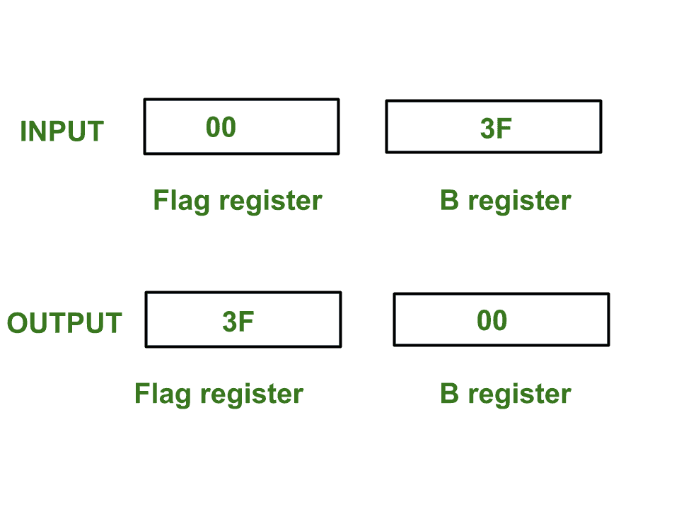

# 8085 程序访问标志寄存器的内容并与寄存器 B 交换

> 原文: [https://www.geeksforgeeks.org/8085-program-access-exchange-content-flag-register-register-b/](https://www.geeksforgeeks.org/8085-program-access-exchange-content-flag-register-register-b/)

## 问题–
在 8085 微处理器中编写汇编语言程序，访问 `flag` 寄存器，将 `Flag` 寄存器 `F` 的内容与寄存器 `b` 进行交换。

## 示例–


## 假设–
标志寄存器、寄存器 `B` 和堆栈指针的初始值分别为 `00`、`3F` 和 `3FFF`。

`PSW` 代表**程序状态字**。`PSW` 结合了累加器 `A` 和标志寄存器 `F`。

## 算法–
1.  借助 `PUSH` 指令，推送内存堆栈中 `PSW` 的值。
2.  借助 `POP` 指令，弹出标志寄存器的值并将其存储在寄存器 `H` 中。
3.  移动寄存器 `C` 中寄存器 `H` 的值。
4.  移动寄存器 `H` 中寄存器 `B` 的值。
5.  移动寄存器 `B` 中寄存器 `C` 的值。
6.  借助 `PUSH` 指令推内存栈中寄存器 `H` 的值。
7.  使用 `POP` 指令从内存堆栈中弹出 `PSW` 的值。

## 程序–
| 内存地址 | 助记符 | comment |
| :--- | :--- | :--- |
| 2000 | `PUSH PSW` | 堆栈中累加器和标志的推送值 |
| 2001 | `POP H` | `H` 中内存堆栈顶部的弹出值 |
| 2002 | `MOV C, H` | `C <- H` |
| 2003 | `MOV H, B` | `H <- B` |
| 2004 | `MOV B, C` | `B <- C` |
| 2005 | `PUSH H` | 推寄存器 `H` 的值 |
| 2006 | `POP PSW` | 从堆栈弹出到 `PSW` |
| 2007 | `HLT` | 停止执行 |

## 解释–
使用的寄存器：`A`、`B`、`C`、`H`、`F`

1.  `PUSH PSW` 指令执行以下任务:
    ```
    SP <- SP - 1
    M[SP] <- A
    SP <- SP - 1
    M[SP] <- F
    ```

2.  `POP H` 指令执行以下任务:
    ```
    H <- M[SP]
    SP <- SP + 1
    ```

3.  `MOV C, H` – 移动寄存器 `C` 中 `H` 的值。
4.  `MOV H, B` – 移动寄存器 `H` 中 `B` 的值，因此 `H` 被更新。
5.  `MOV B, C` – 移动寄存器 `B` 中 `C` 的值，因此 `B` 被更新。
6.  `PUSH H` 执行以下任务:
    ```
    SP <- SP - 1
    M[SP] <- H
    ```

7.  `POP PSW` 执行以下任务:
    ```
    F <- M[SP]
    SP <- SP + 1
    A <- M[SP]
    SP <- SP + 1
    ```

8.  `HLT` – 停止执行程序并停止任何进一步的执行。