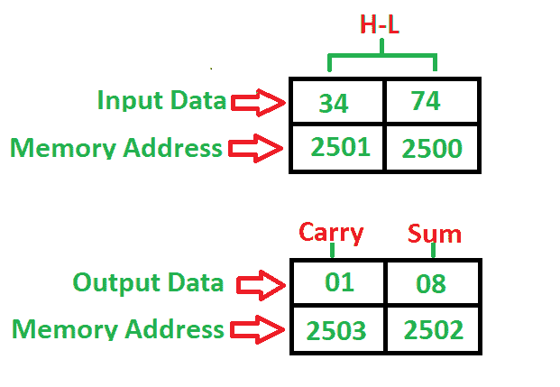

# 8085 程序添加 2-BCD 号

> 原文: [https://www.geeksforgeeks.org/8085-program-add-2-bcd-numbers/](https://www.geeksforgeeks.org/8085-program-add-2-bcd-numbers/)

## 问题
编写一个程序，将起始地址为 `2000` 的 2-BCD 号码相加，号码存储在 `2500` 和 `2501` 内存地址，并将总和存储到 `2502` 中，进位到 `2503` 内存地址中。

## 示例

## 算法
1.  将 `00H` 载入寄存器(用于进位)
2.  将内容从存储器载入寄存器对
3.  将内容从 `L` 寄存器移到累加器
4.  用累加器添加 `H` 寄存器的内容
5.  如果总和大于 9 或辅助进位不为零，则加 `06H`
6.  如果进位标志不等于 1，转到步骤 8
7.  进位寄存器递增 1
8.  将累加器的内容存储到内存中
9.  将内容从进位寄存器移到累加器
10. 将累加器的内容存储到内存中
11. 停止

## 程序
| 记忆 | 记忆术 | 操作数 | 评论 |
| --- | --- | --- | --- |
| `2000` | `MVI` | `C, 00H` |  |
| `2002` | `LHLD` | `[2500]` | [高-低] |
| `2005` | `MOV` | `A, L` | [A] |
| `2006` | `ADD` | `H` | [A] |
| `2007` | `DAA` |  | 如果总和> 9 或 `AC` = 1，则加 `06` |
| `2008` | `JNC` | `200C` | 没有进位就跳 |
| `200B` | `INR` | `C` | [C] |
| `200C` | `STA` | `[2502]` | [A] -> `[2502]`，总和 |
| `200F` | `MOV` | `A, C` | [A] |
| `2010` | `STA` | `[2503]` | [A] -> `[2503]`，进位 |
| `2013` | `HLT` |  | 停止 |

## 说明
寄存器 `A`、`C`、`H`、`L` 用于通用目的

1.  `MVI` 用于将数据立即移入任何寄存器(2 字节)
2.  `LHLD` 用于使用 16 位地址(3 字节指令)直接加载寄存器对
3.  `MOV` 用于将数据从内存传输到累加器(1 字节)
4.  `ADD` 用于将累加器与任意寄存器相加(1 字节指令)
5.  `STA` 用于将数据从累加器存储到内存地址(3 字节指令)
6.  `DAA` 用于检查和> 9 或 `AC` = 1 相加 `06` (1 字节指令)
7.  `JNC` 用于如果没有进位到给定的存储位置(3 字节指令)，则跳转
8.  `INR` 用于给定寄存器增加 1 (1 字节指令)
9.  `HLT` 用于暂停程序