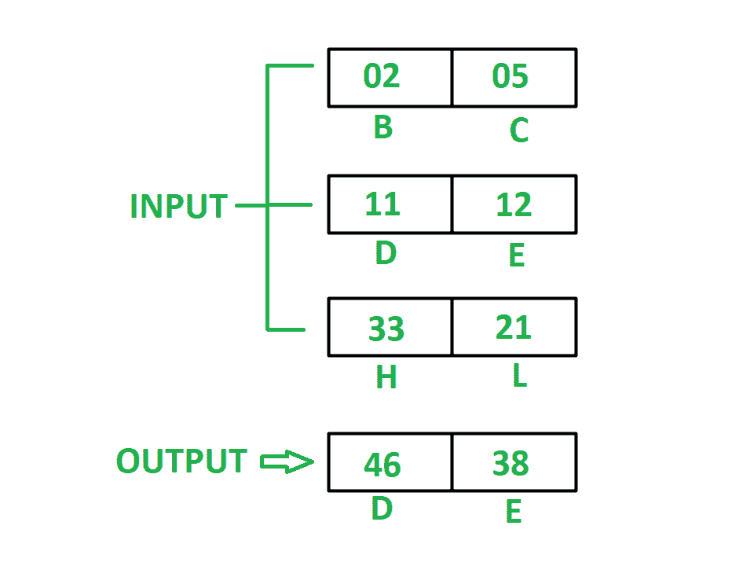

# 8085 程序将寄存器中存储的三个 16 位数字相加

> 原文: [https://www.geeksforgeeks.org/8085-program-add-three-16-bit-numbers-stored-registers/](https://www.geeksforgeeks.org/8085-program-add-three-16-bit-numbers-stored-registers/)

## 问题
编写汇编语言程序，将存储在寄存器 `HL`、`DE`、`BC` 中的三个 16 位数字相加，用最少的指令数将结果存储在 `DE` 中。

## 示例


## 假设
1.  要添加的号码已经存储在寄存器 `HL`、`DE`、`BC` 中。
2.  存储在寄存器中的数字使得最终结果不应大于 `FFFF`。

`DAD D` 执行以下任务:
```
H <- H + D
L <- L + E
```
`DAD` 指令取一个自变量，自变量可以是寄存器 `B`、`D`、`H` 或 `SP`。`XCHG` 指令用 `H` 交换寄存器 `D` 的内容，用 `L` 交换寄存器 `E` 的内容。

## 算法
1.  借助 `DAD` 指令，将 `DE` 寄存器的内容添加到 `HL` 中，并将结果存储到 `HL` 中。
2.  将寄存器 `B` 的内容移到 `D`，将寄存器 `C` 的内容移到 `E`。
3.  重复步骤 1。
4.  用 `XCHG` 指令将 `DE` 的内容换成 `HL`。我们会在 `DE` 得到结果。

## 程序
```
内存地址    助记符        注释
2000        DAD D        H <- H + D, L <- L + E
2001        MOV D, B     D <- B
2002        MOV E, C     E <- C
2003        DAD D        H <- H + D, L <- L + E
2004        XCHG         用 DE 交换 HL 的内容
2005        HLT          END
```

## 解释
1.  `DAD D` – 将 `H` 中的寄存器 `D` 和 `L` 中的寄存器 `E` 的内容相加，并将结果存储在 `HL` 中。
2.  `MOV D, B` – 移动寄存器 `B` 的值到寄存器 `D`。
3.  `MOV E, C` – 移动寄存器 `C` 的值到寄存器 `E`。
4.  与步骤 1 相同。
5.  `XCHG` – 用寄存器 `D` 交换寄存器 `H` 的内容，用寄存器 `E` 交换寄存器 `L` 的内容。
6.  `HLT` – 停止执行程序并停止任何进一步的执行。