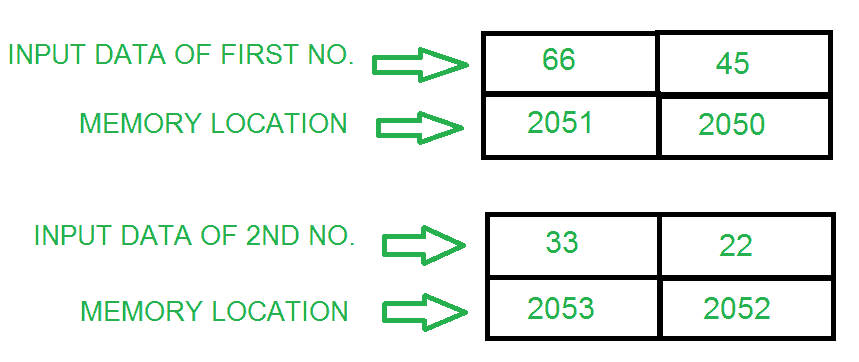
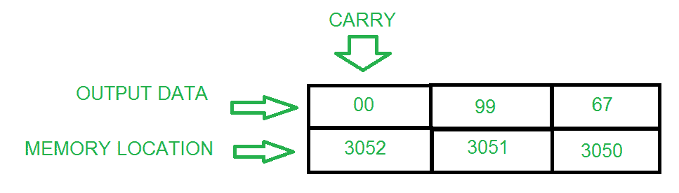

# 8085 程序添加两个 16 位数字

> 原文: [https://www.geeksforgeeks.org/8085-program-add-two-16-bit-numbers/](https://www.geeksforgeeks.org/8085-program-add-two-16-bit-numbers/)

**问题–** 编写一个汇编语言程序，通过使用:
*   (a) 8 位操作
*   (b) 16 位操作

**示例–**

## (a) 使用 8 位操作添加 16 位数字

这是一种冗长的方法，与 16 位操作相比需要更多的内存。

### 算法

1.  将第一个数字的下半部分载入 `B` 寄存器
2.  将第二个数字的下半部分装入 `A`(累加器)
3.  将数字和存储相加
4.  将第一个数字的较高部分载入 `B` 寄存器
5.  将第二个数字的较高部分装入 `A`(累加器)
6.  从较低的字节(如果有的话)开始将两个数字相加并存储在下一个位置

### 程序

| 存储地址 | 记忆术 | 评论 |
| --- | --- | --- |
| `2000` | `LDA 2050` | `A <- [2050]` |
| `2003` | `MOV B, A` | `B <- A` |
| `2004` | `LDA 2052` | `A <- [2052]` |
| `2007` | `ADD B` | `A <- A + B` |
| `2008` | `STA 3050` | `[3050] <- A` |
| `200B` | `LDA 2051` | `A <- [2051]` |
| `200E` | `MOV B, A` | `B <- A` |
| `200F` | `LDA 2053` | `A <- [2053]` |
| `2012` | `ADC B` | `A <- A + B + CY` |
| `2013` | `STA 3051` | `[3051] <- A` |
| `2016` | `HLT` | 停止执行 |

### 解释

1.  `LDA 2050` 将 `2050` 处的值存储在 `A`(累加器)中
2.  `MOV B, A` 将 `A` 的值存入 `B` 寄存器
3.  `LDA 2052` 将 `2052` 的值存储在 `A` 中
4.  `ADD B` 添加 `B` 和 `A` 的内容，保存在 `A` 中
5.  `STA 3050` 将结果存储在存储单元 `3050` 中
6.  `LDA 2051` 将 `2051` 的值存储在 `A` 中
7.  `MOV B, A` 将 `A` 的值存入 `B` 寄存器
8.  `LDA 2053` 将 `2053` 的值存储在 `A` 中
9.  `ADC B` 将 `B`、`A` 的内容相加，从低位相加进位，存入 `A`
10. `STA 3051` 将结果存储在存储单元 `3051` 中
11. `HLT` 停止执行

## (b) 使用 16 位操作添加 16 位数字

这是一种非常短的方法，与 8 位操作相比，也需要更少的内存。

### 算法

1.  一次加载第一个数字的低位和高位
2.  将第一个数字复制到另一个寄存器对
3.  同时加载第二个数的低位和高位
4.  将两个寄存器对相加，并将结果存储在内存位置

### 程序

| 存储地址 | 记忆术 | 评论 |
| --- | --- | --- |
| `2000` | `LHLD 2050` | `H-L <- [2051]-[2050]` |
| `2003` | `XCHG` | `D <-> H & E <-> L` |
| `2004` | `LHLD 2052` | `H-L <- [2053]-[2052]` |
| `2007` | `DAD D` | `H-L <- H-L + D-E` |
| `2008` | `SHLD 3050` | `[3051]-[3050] <- H-L` |
| `200B` | `HLT` | 停止执行 |

### 解释

1.  `LHLD 2050` 将 `2050` 处的值载入 `L` 寄存器，将 `2051` 处的值载入 `H` 寄存器(第一个数字)
2.  `XCHG` 将 `H` 的内容复制到 `D` 寄存器，将 `L` 的内容复制到 `E` 寄存器
3.  `LHLD 2052` 加载 `L` 寄存器中 `2052` 处的值和 `H` 寄存器中 `2053` 处的值(第二个数)
4.  `DAD D` 将 `H` 的值与 `D` 相加，将 `L` 的值与 `E` 相加，并将结果存储在 `H` 和 `L` 中
5.  `SHLD 3050` 将结果存储在存储器位置 `3050`
6.  `HLT` 停止执行